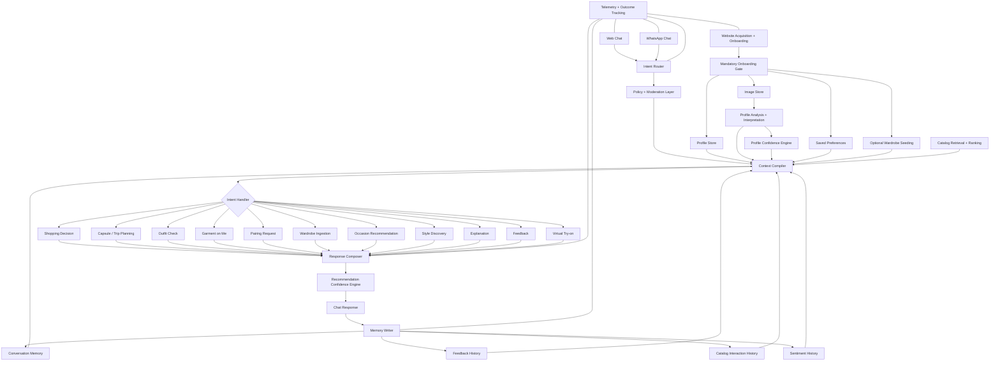

# Application Layer — Implementation Specification

Last updated: April 11, 2026 (Color overhaul: 12 sub-season, draping removed, BodyShape mapping)

> **⚠️ Partially deprecated.** Sections of this document still describe the
> *legacy* routing layer (`intent_router.py`, `intent_handlers.py`,
> `context_gate.py`, `context/occasion_resolver.py`) which has been **deleted**
> from the codebase and replaced by the LLM copilot planner inlined into
> `process_turn`. See `docs/CURRENT_STATE.md` § "Completed work (March 20,
> 2026)" for the teardown record.
>
> When this file and `docs/CURRENT_STATE.md` disagree, **`CURRENT_STATE.md`
> is the source of truth**. The accurate parts of this file are the agent
> prompt structure, evaluator schema, and step-by-step pipeline narration.
> Anything that names the deleted modules above is stale and should be
> read as historical context only.

## Product Positioning

> **For** people who want to dress better every day, **Aura is** a personal fashion copilot **that** knows your body, your style, and your wardrobe — so you always know what to wear and what's worth buying.

Strategy: **stylist for retention, shopping for revenue.** Users make Aura part of their lifestyle — checking outfits, getting pairing advice, planning what to wear. They can also shop from it: complete outfit recommendations, gap-filling for pieces they already own, or buy/skip verdicts on items they're considering. Dependency keeps them on the platform; shopping generates revenue.

## Current Implementation Status

This document serves two purposes:
- the implementation specification and contract for the fashion copilot runtime in `modules/agentic_application`
- the prioritized build plan for closing the gap between current state (shopping-first recommendation engine) and target state (lifestyle stylist with shopping)

For the user-facing product summary, personas, journeys, and stories, see `docs/PRODUCT.md`.
For the current project state, gap analysis, and file layout, see `docs/CURRENT_STATE.md`.
For detailed step-by-step execution flows, see `docs/WORKFLOW_REFERENCE.md`.

Implemented now:
- **intent registry** (`intent_registry.py`): StrEnum-based single source of truth for the post-Phase 12A taxonomy — 7 advisory intents + silent `wardrobe_ingestion` (8 total `Intent` members), 7 actions (`Action`), and 7 follow-up intents (`FollowUpIntent`) — with metadata registries and JSON schema helpers; consumed by planner, orchestrator, agents, API, and tests. Phase 12A folded `shopping_decision` / `garment_on_me_request` / `virtual_tryon_request` into `garment_evaluation`, `product_browse` into `occasion_recommendation` (via `target_product_type`), and deferred `capsule_or_trip_planning`.
- copilot planner (gpt-5.4) — intent classification across the 7 advisory intents + feedback, 7-action dispatch (JSON schema enums generated from registry)
- active runtime entrypoint in `agentic_application/api.py` with `AgenticOrchestrator`
- saved user-context loading from onboarding/profile-analysis/style-preference persistence
- server-side conversation-memory carry-forward across follow-up turns
- planner-driven runtime with deterministic handler overrides for pairing, outfit check, source preference, and catalog CTA follow-up
- strict JSON schema with enum-constrained hard filter vocabulary
- **tiered hard filter / soft signal system** (April 9 2026): `gender_expression` always hard; `garment_subtype` conditional (hard for specific requests, null for broad); `garment_category` and `styling_completeness` are soft signals in query document text only — never hard filters
- soft signals via embedding similarity only: `garment_category`, `styling_completeness`, `occasion_fit`, `formality_level`, `time_of_day`
- no filter relaxation — single search pass per query
- **batched embedding** (all query documents in one OpenAI API call) + **parallel search+hydrate** (ThreadPoolExecutor, 4 workers) — ~4x retrieval speedup
- embedding retrieval from `catalog_item_embeddings` with hydration from `catalog_enriched`
- direction-aware retrieval: `needs_bottomwear` for top (all direction types), `needs_topwear` for bottom, `["needs_innerwear"]` for outerwear, `complete` for complete directions. Outerwear exclusively in outerwear role.
- **direction-aware reranker**: round-robin picks one candidate per direction before filling by score — guarantees outfit variety across architect's concepts
- previous recommendation exclusion: follow-up turns exclude prior product IDs from retrieval
- deterministic assembly and LLM evaluation with graceful evaluator fallback
- architect failure returns error to user (no silent degradation)
- latency tracking via `time.monotonic()` per agent stage
- persisted turn artifacts: live context, memory, plan, applied filters, retrieved IDs, assembled candidates, final recommendations
- response formatting for recommendation-pipeline turns (max 3 outfits) with 16-field item cards; dedicated handlers can return bounded multi-look outputs beyond that
- virtual try-on via Gemini (`gemini-3.1-flash-image-preview`) with parallel generation, quality gate, persistent disk + DB storage (`virtual_tryon_images` table), and cache reuse by user + garment ID set
- 2-column PDP outfit cards (hero 3:4 aspect `object-fit: cover` + 36% info panel) with click-to-cycle hero + `1/N` counter badge, split polar bar chart (Nightingale-style: top semicircle = 8-axis style archetype profile in champagne `--signal`, bottom semicircle = dynamic 5-9 axis fit/evaluation profile in oxblood `--accent`, colours read from CSS custom properties via `getComputedStyle` so they flip for dark mode), feedback strip at bottom (heart SVG icon for like + "What would you change?" inline textarea with reaction chips for constructive dislike feedback)
- `analysis_confidence_pct` — attribute-level analysis confidence used to scale evaluation scores at render time
- per-outfit feedback capture with turn-level correlation
- wardrobe ingestion from chat with vision-API enrichment and dual-layer image moderation
- wardrobe-first occasion, pairing, outfit-check follow-through, and capsule/trip support
- pairing request image gate: asks user for garment image when message references "this shirt" but no image attached
- anchor_garment on LiveContext: uploaded garment passed to architect with full enrichment attributes; architect skips anchor's role; anchor injected as sole item for its role before assembly
- **P0 open: pairing pipeline end-to-end fix still needed** — anchor injection + role stripping code exists but deployment issues prevent validation; see `docs/CURRENT_STATE.md` for details
- explicit source selection metadata: wardrobe-first, catalog-only, or hybrid
- deterministic 12-sub-season color analysis (draping removed — deterministic interpreter is sole authority)
- color palette system: base/accent/avoid colors derived from seasonal group, passed to copilot planner, outfit architect, and outfit check agents
- comfort learning: behavioral seasonal palette refinement from outfit likes
- profile confidence engine and recommendation confidence engine (9-factor, 0–100 scoring)
- dual-layer image moderation (heuristic blocklist + vision API)
- restricted category exclusion in catalog retrieval
- conversation management: rename (PATCH) and delete/archive (DELETE) endpoints with sidebar UI
- wardrobe edit modal (all metadata fields) and per-card delete with confirmation
- wardrobe: borderless 5-column closet grid, uppercase tracked label filter chips, hairline-underline search, right-edge Add Item drawer, per-card edit/delete as hover-reveal text buttons, localStorage filter persistence
- dependency/retention instrumentation (turn-completion events, cohort anchors, memory-input lift)
- follow-up turns with 7 follow-up intent types
- `response_type` field: `"recommendation"` | `"clarification"`
- quick-reply suggestion chips for clarification responses
- profile as style dossier: display-xl Fraunces name hero, italic adjective list, champagne signal rule on palette card, underline-only edit inputs, theme toggle, flat analysis badges
- chat: italic Fraunces welcome headline, borderless stylist bubbles (2px ink left rule on agent copy), ⌘K history rail toggle, follow-up uppercase bucket headers, stylist-voice stage messages (one-per-poll advance), 960px feed width
- header nav: 56px, uppercase tracked label links with ink underline active state, Home · Outfits · Checks · Wardrobe · Saved (Phase 15: intent-organized, no chat tab)
- wardrobe add-item drawer (right-edge slide) — photo-only upload with auto-enrichment (46 attributes via vision API)
- catalog pipeline: auto-generated product_id from URL for CSVs lacking the column
- Outfits tab (Phase 15 — replaces Looks + Trial Room): intent-grouped history with PDP carousels per occasion/intent section. Each section = Fraunces italic title + relative time + swipeable PDP cards. Try-on images embedded in PDP cards. Liked outfits persist with filled heart; hidden outfits filtered from history via (turn_id, outfit_rank) keys in feedback_events. Read-time hydration for historical turns missing outfits.
- Checks tab (Phase 15): outfit check history — each check as a card with user message + stylist assessment
- Home tab (Phase 15 — replaces Chat): discovery surface with centered input + PDP carousel for active request + recent intent group previews. No chat bubbles, no conversation sidebar.
- Intent-history endpoint: `GET /v1/users/{id}/intent-history` groups turns by (intent, occasion), embeds try-on images, supports `?types=` filter, filters disliked outfits, tags liked outfits
- Confident Luxe design system across onboarding, processing, main app, and admin — ivory `#F7F3EC` canvas, oxblood `#5C1A1B` accent, champagne `#C6A15B` signal (personal cues only), Fraunces (display) + Inter (body) + JetBrains Mono (labels), hairline borders replacing shadows on static cards, full dark mode parity via `[data-theme="dark"]`, motion system (single easing curve, 120/240/480ms durations, view-enter fade+rise, runway label track-in, staggered Looks grid entrance, `prefers-reduced-motion` override)

Remaining work is now concentrated in hardening and live-environment validation rather than core intent/runtime capability gaps. See `docs/CURRENT_STATE.md` for the execution checklist.

## Strategic Product Direction

This section defines the target product state. The current runtime implements the recommendation pipeline and supporting infrastructure. The remaining build work is closing the gap to a full lifestyle copilot.

### Product Definition

> A mandatory-onboarding, memory-backed personal fashion copilot that helps the user make better shopping and dressing decisions over time through an intent-organized discovery surface with PDP carousels.

Core principles:
- onboarding is required before chat access
- wardrobe onboarding is optional for the user, but wardrobe support is mandatory in the system
- wardrobe-first answers across all intents — catalog fills gaps, not the default
- dependency is the product metric; shopping is the business model
- chat is the primary operating surface after onboarding

### First-50 Validation Goal

The next implementation phase is not trying to validate generic "AI engagement."

It is trying to validate **dependency** for the first 50 onboarded users.

Dependency means the user returns to the system before or during real clothing decisions such as:
- whether to buy an item
- what to pair with an item
- what to wear for an occasion
- how to plan a workweek, travel set, or mini capsule

The first-50 validation goal is:
- acquire 50 fully onboarded users
- observe repeated use through WhatsApp after onboarding
- determine which intents become recurring anchors in the user's life
- learn whether the product becomes a pre-buy / pre-dress habit rather than a one-time novelty

### Operating Surfaces

#### 1. Website — onboarding and discovery

Website responsibilities:
- capture acquisition source and ICP hypothesis
- enforce pre-chat onboarding gate
- collect mandatory profile data
- collect required images and run analysis
- collect required saved preferences
- optionally collect wardrobe items
- show profile confidence and how to improve it
- provide the first successful chat session

#### 2. WhatsApp — retention and repeat usage

WhatsApp responsibilities:
- serve as the lightweight repeat-use surface after onboarding
- accept new user intents in natural language or images/links
- support quick conversational loops with low friction
- drive return usage for shopping, pairing, occasion, and wardrobe-first requests
- send re-engagement nudges and reminders
- deep-link back to web only for heavy tasks:
  - image re-capture
  - wardrobe management
  - confidence detail
  - profile edits

### Mandatory Pre-Chat Onboarding Contract

Chat access is blocked until the user completes required onboarding.

Required before first chat:
- identity/contact record
- consent + safety acknowledgement
- baseline profile:
  - name
  - date of birth
  - gender / gender expression mapping policy
  - height
  - waist
  - profession
- required images:
  - full-body
  - headshot
- profile analysis run
- deterministic interpretations
- saved preferences / style preference completion

Optional during onboarding:
- wardrobe upload / wardrobe seeding

Rationale:
- the system depends on profile-aware reasoning
- confidence reporting must be grounded in actual evidence
- the user must see why the system is confident or not confident
- optional wardrobe memory should increase value, but should not block first access if the mandatory onboarding contract is satisfied

### Data Contract for the Copilot

#### Required pre-chat state

The system must have these records before chat unlocks:
- `user_profile`
- `onboarding_images`
- `analysis_attributes`
- `derived_interpretations`
- `style_preferences`
- `profile_confidence_state`
- `consent_and_guardrail_state`

#### Optional user-supplied state

The user may provide these at onboarding or later:
- `wardrobe_items`
- `wardrobe_item_images`
- `favorite_brands`
- `budget_bounds`
- `occasion_preferences`

#### System-generated memory

These are not onboarding inputs for a first-time user, but they are mandatory for the long-term intelligence of the system:
- `user_queries`
- `conversation_turns`
- `feedback_history`
- `catalog_interaction_history`
- `wardrobe_usage_history`
- `sentiment_history`
- `recommendation_history`
- `confidence_history`
- `policy_events`

### Intent Taxonomy

The system routes every incoming message into one primary intent and optional follow-up intents.

Primary intent taxonomy (post-Phase 12A: 7 advisory + silent wardrobe_ingestion):

| Intent ID | User job | Typical inputs | Core data sources | Core outputs |
|---|---|---|---|---|
| `occasion_recommendation` | "What should I wear for this occasion?" / "Show me items matching X" (when `target_product_type` is set) | occasion, formality, weather/trip/work context, optional product type | wardrobe, profile, catalog, history | wardrobe-first outfit(s), optional catalog upsell, or single-product cards |
| `pairing_request` | "What goes with this piece?" | wardrobe item image, product link, text | wardrobe, catalog, preferences, history | pairings from wardrobe first, then catalog; uploaded garment becomes the anchor in every paired candidate |
| `garment_evaluation` | "Should I buy this?" / "How will this look on me?" / "Try this on me." | garment image / product link + user image context | profile, body/color interpretation, catalog, try-on, visual evaluator | tryon-grounded verdict, fit/proportion critique, optional buy/skip |
| `outfit_check` | "How does what I'm wearing look?" | current outfit image(s) | profile, analysis, preferences, past feedback | outfit assessment, improvement suggestions, confidence |
| `style_discovery` | "What style suits me?" | text question, profile, images | analysis, interpretations, preferences | style explanation, archetype rationale, next actions |
| `explanation_request` | "Why did you recommend this?" | reference to prior answer | prior chats, recommendation history, confidence state | transparent explanation |
| `feedback_submission` | "I liked / disliked this." | explicit feedback | recommendation history, wardrobe, comfort learning | stored feedback + learning update |
| `wardrobe_ingestion` | (silent) "Save this into my wardrobe." | item image(s), link, text | profile, moderation, wardrobe store | wardrobe item saved + 46-attribute enrichment. **Not** classified by the planner from user messages — programmatic / bulk-upload path only. |

Removed in Phase 12A (do not extend):
- `shopping_decision`, `garment_on_me_request`, `virtual_tryon_request` → folded into `garment_evaluation` (visually-grounded evaluator pipeline)
- `product_browse` → folded into `occasion_recommendation` via `target_product_type`
- `capsule_or_trip_planning` → deferred (will return as a multi-day intent in a later phase)

Intent routing requirements:
- each turn must have exactly one primary intent
- the router may attach secondary intents
- every routed intent must record:
  - routing confidence
  - data sources read
  - memory written
  - policies triggered

### Confidence Model

The UI should show confidence, but the confidence must be decomposable and explainable.

#### 1. Profile confidence

Profile confidence answers:
- how complete is the user's style/body/color profile?
- how reliable is the personalization basis behind future recommendations?

Profile confidence should be computed from weighted factors:
- profile completeness
- image quality
- image coverage
- analysis confidence
- interpretation confidence
- style preference completion
- wardrobe coverage, if present
- consistency of explicit feedback over time

Profile confidence UX contract:
- show a percentage
- show the top missing evidence
- show which onboarding actions improve the score

Example:
- `Profile confidence: 68%`
- `Improve to 82% by uploading a clearer full-body photo`
- `Improve to 89% by saving 5 wardrobe staples`

#### 2. Recommendation confidence

Recommendation confidence answers:
- how strongly does the system believe this answer fits the user and the request?

Recommendation confidence should consider:
- clarity of detected intent
- clarity of occasion/context
- profile confidence
- wardrobe coverage for wardrobe-first requests
- catalog metadata completeness
- retrieval depth / candidate quality
- prior positive signals on similar items or styles
- virtual try-on quality gate status if try-on is involved

The system must never show a recommendation confidence percentage without an internal explanation payload.

### Safety and Guardrail Contract

The next-phase product must enforce the following guardrails:

#### Image upload guardrails
- reject nude or sexually explicit user images
- reject images of minors
- reject lingerie / underwear product uploads if outside allowed scope
- reject non-garment wardrobe uploads when the user is trying to save wardrobe items

#### Recommendation guardrails
- exclude lingerie / underwear from:
  - catalog retrieval
  - wardrobe pairing
  - outfit check recommendations
  - virtual try-on request fulfillment
- prevent unsafe or distorted outputs from reaching the user

#### Virtual try-on guardrails
- try-on must fail closed
- if composition quality is poor, body distortion is visible, or garment fidelity is broken, the result must not be shown
- the user should receive a safe fallback explanation instead of a bad image

#### Auditability

Every moderation / policy decision should emit a structured event:
- `policy_event_type`
- input class
- reason code
- blocked / allowed / escalated
- model or rule source

### Suggested Architecture Diagram



### High-Level Implementation Plan

Implementation is organized in phases. Phases 0–3 and Phase 6 are substantially complete. The remaining work focuses on closing the gap between the current shopping-first engine and the target lifestyle stylist.

#### Phase 0 — contracts, analytics, and truth model — COMPLETE

Status: done.
- formal intent taxonomy defined (8 intents post-Phase 12A consolidation)
- event schema for turn-completion, feedback, and dependency validation
- confidence formula documented for profile and recommendation engines
- first-50 success metrics defined

#### Phase 1 — onboarding gate and confidence foundation — COMPLETE

Status: done.
- onboarding gate enforced before chat access
- profile confidence engine operational
- optional wardrobe onboarding entry point available
- acquisition source tracking on OTP verification

#### Phase 2 — unified memory model — COMPLETE

Status: done.
- conversation memory carry-forward across turns
- feedback history with turn-level correlation
- wardrobe item persistence with enrichment metadata
- comfort learning (behavioral seasonal palette refinement)
- turn artifact persistence (live context, memory, plan, filters, candidates, recommendations)

#### Phase 3 — intent router and handler contracts — COMPLETE

Status: router and dedicated handler set are implemented in runtime.

Done:
- copilot planner classifies 8 intents with action dispatch (post-Phase 12A)
- `run_recommendation_pipeline` handler fully operational (occasion recommendation)
- `run_outfit_check` handler implemented with structured scoring, critique, and improvement suggestions
- `run_shopping_decision` handler implemented with product parsing, verdicting, wardrobe overlap checks, and pairing follow-up
- `pairing_request` handler implemented with deterministic garment-led routing overrides, wardrobe-image pairing, and catalog-image pairing
- `style_discovery` handler implemented with profile-grounded explanation and deterministic attribute-level advice for color, collar, neckline, pattern, silhouette, and archetype questions
- `explanation_request` handler implemented with recommendation-evidence explanations from prior turn context
- `capsule_or_trip_planning` handler implemented with trip-duration-aware multi-look planning, daypart/context labeling, and catalog-supported gap coverage
- `respond_directly` and `ask_clarification` actions for non-recommendation turns
- `save_wardrobe_item` and `save_feedback` actions implemented
- `run_virtual_tryon` action implemented
- wardrobe-first occasion response implemented

#### Phase 4 — wardrobe + catalog blend — COMPLETE

Status: wardrobe-first and catalog-follow-through contract implemented across occasion, pairing, outfit-check follow-up, and capsule planning.

Done:
- wardrobe ingestion from chat with vision-API enrichment and moderation
- wardrobe retrieval and count
- wardrobe-first occasion response in orchestrator
- wardrobe source labeling in WhatsApp formatter
- explicit source preference routing (`from my wardrobe`, `from the catalog`) with `source_selection` metadata
- catalog upsell follow-through after wardrobe-first occasion and outfit-check answers
- wardrobe-image vs catalog-image pairing distinction at intake and runtime

#### Phase 5 — WhatsApp retention surface — REMOVED

Status: code removed from codebase as of April 2026. WhatsApp services (formatter, deep links, reengagement, runtime) were deleted. WhatsApp remains a target retention surface in product strategy but will need to be rebuilt when ready.

Previously implemented (now removed):
- WhatsApp message formatting (outfits, suggestions, source labeling)
- deep linking with task routing (onboarding, wardrobe, tryon review, chat)
- WhatsApp Business API integration — inbound webhook, outbound delivery
- cross-channel identity resolver — phone number → user_id mapping
- input normalizer for WhatsApp message format (text, images, product links)
- re-engagement trigger logic (when to nudge, what to say)
- onboarding gate enforcement for WhatsApp inbound

#### Phase 6 — safety, try-on, and trust layer — COMPLETE

Status: done.
- dual-layer image moderation (heuristic blocklist + vision API check)
- restricted category exclusion in catalog retrieval
- virtual try-on quality gate (fails closed)
- virtual try-on persistence: images saved to `data/tryon/images/` with metadata in `virtual_tryon_images` table; cache reuse by user + garment IDs avoids re-generation for same outfit
- policy event logging for all moderation decisions
- wardrobe upload moderation (rejects non-garment, explicit, minor images)

#### Phase 7 — first-50 dependency validation — PARTIAL

Status: instrumentation done, rollout pending.

Done:
- dependency validation event schema
- turn-completion events across web / WhatsApp
- cohort anchors and retention reporting
- memory-input lift measurement

Not done:
- [ ] first-50 user recruitment
- [ ] recurring-intent analysis from live data
- [ ] dependency and referral reporting from real cohorts

### Implementation Priority (Build Order)

This is the prioritized build sequence for closing the remaining gaps.

#### P0 — WhatsApp Runtime + Cross-Channel Identity — REMOVED / PENDING REBUILD
Why: no repeat usage without this. WhatsApp is the retention surface.
Status: code was removed from the codebase. Will need to be rebuilt when ready for first-50 rollout.
- WhatsApp Business API integration (inbound webhook + outbound delivery)
- cross-channel identity resolver (phone → user_id)
- input normalizer (text, images, product links from WhatsApp format)
- onboarding gate enforcement for WhatsApp
- re-engagement trigger logic

#### P1 — Outfit Check Pipeline — COMPLETE
Why: highest daily-use intent. "Does this work?" before leaving the house drives habit.
- dedicated handler: user uploads outfit photo → evaluate against profile
- scoring: body harmony, color suitability, style fit, occasion appropriateness
- improvement suggestions: wardrobe-first swaps, then catalog
- confidence-aware critique

#### P1 — Shopping Decision Agent — COMPLETE
Why: clearest revenue path. "Should I buy this?" = purchase intent.
- product link/screenshot parser
- buy/skip verdict against user profile
- wardrobe dedup check
- pairing follow-up from wardrobe then catalog

#### P1 — Wardrobe-First Routing Across All Intents — COMPLETE
Why: makes the product feel like a stylist, not a shopping app.
- extend wardrobe-first beyond occasion to: pairing, capsule, outfit check suggestions
- wardrobe gap detection → catalog nudge
- source labeling in every response (wardrobe vs catalog)

#### P2 — Pairing Agent (Wardrobe-First Mode) — COMPLETE
Why: bridges retention and revenue naturally.
- wardrobe-first pairing search
- hybrid response: wardrobe pairs + catalog alternatives
- source labeling

#### P2 — Wardrobe Management UI — COMPLETE
Why: users need to see and trust their wardrobe data.
- web-based wardrobe browsing (view, edit, delete)
- wardrobe completeness scoring
- gap analysis view
- edit modal with all metadata fields (title, description, category, subtype, colors, pattern, formality, occasion, brand, notes)
- per-card delete with confirmation dialog
- search bar, enhanced category filter chips (8), color filter row (11), localStorage filter persistence
- conversation rename (inline edit) and delete (archive) in sidebar

#### P2 — Style Discovery + Explanation Handlers — COMPLETE
Why: builds trust and keeps users engaged.
- profile-grounded style explanation using actual analysis data
- recommendation explanation using evaluator scores + profile evidence
- confidence rationale in user-facing language

#### P3 — Capsule / Trip Planning — COMPLETE
Why: high value but lower frequency.
- multi-outfit planning (wardrobe first, catalog for gaps)
- packing list (deduplicated items across outfits)
- gap shopping list → catalog

### User Stories and Clear Outcome Measures

The implementation should be judged against the following user stories and acceptance outcomes.

#### US-01 — Mandatory onboarding before chat

As a new user, I must complete onboarding before I can access chat so that the system has enough evidence to personalize safely.

Acceptance outcomes:
- chat is inaccessible until onboarding is complete
- onboarding explicitly shows what is required vs optional
- the user sees profile confidence and how to improve it

#### US-02 — Shopping decision

As an onboarded user, I can share a product link, screenshot, or garment image and ask whether I should buy it.

Acceptance outcomes:
- response includes buy / skip
- response explains why
- response includes pairing guidance
- response stores the request and later outcomes for learning

#### US-03 — Daily-use or travel capsule request

As an onboarded user, I can ask for a set of outfits for daily use or a particular trip.

Acceptance outcomes:
- response is bounded to the requested context
- wardrobe is used first if available
- missing wardrobe / catalog gaps are made explicit
- trip duration expands the look count up to a bounded multi-day plan
- response can mix wardrobe and catalog fillers when wardrobe depth is insufficient

#### US-04 — Outfit check for what I am wearing

As an onboarded user, I can send my current outfit and ask how it looks.

Acceptance outcomes:
- the system evaluates the look against my profile and request context
- confidence is shown
- suggestions improve the current look, not just replace it

#### US-05 — Garment-on-me request

As an onboarded user, I can send a garment and ask how it would look on me.

Acceptance outcomes:
- the system returns qualitative assessment even if try-on is unavailable
- if try-on is safe and high-quality, the system may attach it
- if try-on quality is poor, the system fails safely

#### US-06 — Pairing request

As an onboarded user, I can share one item and ask what pairs well with it.

Acceptance outcomes:
- system can return pairings from wardrobe
- system can return pairings from catalog
- response identifies whether each pairing came from wardrobe or catalog
- uploaded wardrobe garments and uploaded catalog garments are treated as anchors, not echoed back as one-item answers

#### US-07 — Wardrobe ingestion

As an onboarded user, I can add wardrobe items during onboarding or later through chat.

Acceptance outcomes:
- item is moderated
- item metadata is captured
- item becomes available for future wardrobe-first requests

#### US-08 — Occasion recommendation from wardrobe first

As an onboarded user, I can ask what to wear for an occasion and get an answer based on my wardrobe first.

Acceptance outcomes:
- wardrobe-first outfit recommendation is supported
- the system can nudge better catalog options without replacing the wardrobe-first answer
- the answer explains why the wardrobe option works

#### US-09 — Product and outfit feedback

As an onboarded user, I can give feedback on overall product quality and on specific outfits/items.

Acceptance outcomes:
- explicit feedback is stored with correct linkage to the relevant recommendation or item
- feedback updates future reasoning
- negative feedback suppresses repetition of similar bad outcomes

#### US-10 — Style suitability

As an onboarded user, I can ask what style would look good on me.

Acceptance outcomes:
- the answer references my profile analysis and saved preferences
- the answer is not generic fashion prose
- the answer tells me what additional evidence would improve the result

#### US-11 — Explanation request

As an onboarded user, I can ask why the recommendations are what they are.

Acceptance outcomes:
- the system explains using actual profile, wardrobe, catalog, and past-signal evidence
- explanation is traceable to stored reasoning inputs
- confidence rationale is available internally and summarized externally

#### US-12 — Confidence visibility

As an onboarded user, I can see confidence for my profile analysis and for recommendations.

Acceptance outcomes:
- profile confidence is shown with improvement actions
- recommendation confidence is shown with an interpretable rationale
- confidence never appears without a supporting explanation payload

#### US-13 — Upload guardrails

As the system, I must reject unsafe user images and restricted product categories.

Acceptance outcomes:
- nude images are blocked
- lingerie / restricted items are blocked according to policy
- blocked actions create auditable policy events

#### US-14 — Virtual try-on quality fail-safe

As the system, I must refuse to show try-on output when generation quality is poor or distorted.

Acceptance outcomes:
- bad try-on output is suppressed
- user receives a graceful fallback message
- quality-gate decision is logged

### First-50 Success Measures

The first-50 rollout should be evaluated against the following thresholds.

Activation:
- at least 70% of recruited users complete mandatory onboarding
- median time from onboarding start to first useful answer is under 15 minutes including required analysis wait

Repeat usage:
- at least 40% of onboarded users start a second distinct chat session within 14 days
- at least 25% of onboarded users use the copilot in 3 or more separate sessions within 30 days
- at least 50% of repeat sessions happen through WhatsApp

Behavioral depth:
- at least 30% of onboarded users submit at least one wardrobe item
- at least 40% of onboarded users provide explicit feedback on at least one response
- at least 30% of onboarded users use more than one intent family:
  - shopping
  - dressing
  - wardrobe
  - style / explanation

Trust and safety:
- zero confirmed cases of nude images being accepted
- zero confirmed cases of lingerie / restricted products being recommended where policy says they must be blocked
- zero confirmed cases of visibly distorted try-on output being shown to users

Advocacy:
- at least 10% of onboarded users generate one measurable referral or invitation event

### Definition of Implementation Success

This next phase should be considered successful only if all of the following are true:
- onboarding is mandatory and explainable
- intent-driven chat works on web and WhatsApp
- wardrobe is optional to provide but fully supported by the system
- every major recommendation can explain itself
- confidence is visible and grounded
- policy guardrails are enforced and audited
- first-50 data tells us which intents drive dependency

## Overview

The Application Layer handles every user recommendation request.

It receives a natural language message from the user, loads the saved user profile, resolves live context from the message, generates one or more catalog-optimized retrieval queries, retrieves matching products, assembles outfit candidates when pairing is needed, evaluates them against the user's specific context, and returns ranked recommendations.

No external knowledge documents are injected into prompts in the active runtime. The LLM is relied upon for its inherent fashion knowledge plus the structured user context supplied by the system.

This specification now describes the active runtime closely enough to use as the canonical application reference.

## V1 Scope

Supported in v1:
- complete outfit retrieval
- two-piece pairing retrieval
- follow-up refinement within a conversation
- profile-aware ranking

Not supported in v1:
- three-piece outfit assembly
- open-ended wardrobe planning
- knowledge-module injection
- checkout/cart preparation

## Core Principles

- Use saved user profile as first-class recommendation context.
- Use rule-based live context resolution for speed and determinism.
- Use structured JSON outputs from LLMs, not regex-parsed text.
- Use structured labeled retrieval documents that mirror catalog embedding documents.
- Use the same embedding model and dimensions at query time and catalog time.
- Retrieve from `catalog_item_embeddings` and hydrate product rows from `catalog_enriched`.
- Support both complete outfits and pairing in v1.

## LLM and Model Configuration

Active models used by application agents:

| Agent | Model | Provider | Output Mode |
|---|---|---|---|
| Outfit Architect | `gpt-5.4` | OpenAI | JSON schema (strict) |
| Outfit Evaluator | `gpt-5.4` | OpenAI | JSON schema (strict) |
| Orchestrator (intent + memory) | `gpt-5.4` | OpenAI | JSON schema (strict) |
| User Profiler (visual) | `gpt-5.4` | OpenAI | JSON schema (strict), reasoning effort: high |
| User Profiler (textual) | `gpt-5.4` | OpenAI | JSON schema (strict) |
| User Analysis (onboarding) | `gpt-5.4` | OpenAI | JSON schema (strict), reasoning effort: high |
| Digital Draping | `gpt-5.4` | OpenAI | JSON schema (strict), 3-round vision chain |
| Query Embedding | `text-embedding-3-small` | OpenAI | 1536-dimensional vector |
| Virtual Try-on | `gemini-3.1-flash-image-preview` | Google | Image generation |
| Catalog Enrichment | `gpt-5-mini` | OpenAI | JSON schema |

Architect, evaluator, orchestrator, and profiler use OpenAI's `json_schema` response format with strict validation. The architect has no fallback — failure returns an error to the user. The evaluator has a graceful fallback that ranks by assembly_score. Virtual try-on uses Google Gemini with direct API key authentication (not Vertex AI / service accounts).

## Active Catalog Reality

The current catalog search stack is:
- embedding model: `text-embedding-3-small`
- embedding dimensions: `1536`
- enriched catalog table: `catalog_enriched`
- vector table: `catalog_item_embeddings`
- distance metric: cosine similarity via pgvector

Any application implementation must match that reality.

## System Components

```text
User Message
    |
    v
Orchestrator (agentic_application/orchestrator.py)
    |
    +--> 1. User Context Builder ----> Onboarding Gateway ----> onboarding_profiles, user_derived_interpretations, user_style_preference
    |
    +--> 2. Context Builder (occasion resolver + conversation memory)
    |         +--> rule-based signal extraction via occasion_resolver
    |         +--> conversation memory build from session_context_json
    |
    +--> 3. Context Gate (rule-based, <1ms)
    |         +--> signal scoring: occasion (2.0), formality (1.0), category (1.0), season (0.5), style (0.5), follow-up bonus (1.0)
    |         +--> threshold: 3.0 points
    |         +--> insufficient: short-circuit with clarifying question + quick-reply chips
    |         +--> bypass: "surprise me", follow-up turns, max 2 consecutive blocks
    |
    v
4. Outfit Architect (gpt-5.4, JSON schema)
    |
    v
5. Catalog Search Agent (batched embed + parallel search)
    |    +--> Step 1: batch embed all query documents (1 OpenAI call)
    |    +--> Step 2: parallel search+hydrate (ThreadPoolExecutor, 4 workers)
    |    |    +--> text-embedding-3-small (1536 dim)
    |    |    +--> catalog_item_embeddings (pgvector cosine)
    |    |    +--> catalog_enriched (hydration)
    |    +--> Hard filters: gender_expression (always), garment_subtype (conditional), styling_completeness (directional)
    |    +--> No filter relaxation — single search pass per query
    |
    v
6. Outfit Assembler (deterministic compatibility pruning)
    |
    v
7. Outfit Evaluator (gpt-5.4, JSON schema, fallback: assembly_score ranking)
    |
    v
8. Response Formatter (max 3 outfits)
    |
    v
9. Virtual Try-on (gemini-3.1-flash-image-preview, parallel generation)
    |    +--> person image from onboarding full_body upload
    |    +--> product image from first item in each outfit
    |    +--> prompt from prompt/virtual_tryon.md
    |
    v
User Response + Turn Persistence + Conversation Memory Update
```

## 1. Request Contract

Use server-side conversation state, not client-supplied raw history.

```python
class RecommendationRequest:
    user_id: str
    conversation_id: str
    message: str
```

Why:
- the application already has persistence
- prior turns should be loaded from storage
- raw client-supplied history is easy to drift or spoof

## 2. User Context Builder

### Purpose

Load and normalize all saved user state into one application-facing object.

### Inputs

- onboarding profile
- analysis snapshots
- deterministic interpretations
- style preference snapshot

### Output

```python
class UserContext:
    user_id: str
    gender: str
    date_of_birth: str | None
    profession: str | None
    height_cm: float | None
    waist_cm: float | None

    analysis_attributes: dict
    derived_interpretations: dict
    style_preference: dict

    profile_richness: str   # full | moderate | basic | minimal
```

### Notes

- Use the actual current profile naming, not hypothetical alternate names.
- `HeightCategory` and `WaistSizeBand` should come from deterministic interpretations.
- Style preference should be loaded exactly as stored, including blend ratio, risk tolerance, formality lean, pattern type, and comfort boundaries.
- Current runtime enforces a minimum usable profile before recommendations: `gender`, `SeasonalColorGroup`, and primary archetype/style preference signal.
- `SeasonalColorGroup` is derived deterministically from weighted warmth (SkinUndertone + HairColorTemperature + EyeColor), depth, and chroma → 4-season → 12 sub-season. Digital draping was removed due to systematic LLM cool-bias.
- `SubSeason` (e.g., "Deep Autumn", "Clear Winter") provides finer-grained classification within the primary season.

## 3. Occasion Resolver

### Purpose

Extract structured live context from the incoming message.

### Output

```python
class LiveContext:
    user_need: str
    occasion_signal: str | None
    formality_hint: str | None
    time_hint: str | None
    specific_needs: list[str]
    is_followup: bool
    followup_intent: str | None
```

### Rules

- Rule-based only
- Longest or most specific phrase must match first
- Do not treat a request as a follow-up unless prior assistant recommendations exist in the current conversation

### Important precedence requirement

Phrase ordering must prefer:
- `smart casual` before `casual`
- `work meeting` before `work`
- `black tie` before `formal`

### Specific-needs examples

- `look taller` -> `elongation`
- `look slimmer` -> `slimming`
- `comfortable` -> `comfort_priority`
- `professional` -> `authority`
- `approachable` -> `approachability`

## 4. Conversation Memory

### Purpose

Preserve cross-turn state so follow-up requests carry forward prior context.

### Schema

```python
class ConversationMemory:
    occasion_signal: str | None
    formality_hint: str | None
    time_hint: str | None
    specific_needs: list[str]
    # plan_type removed — direction_type is per-direction
    followup_count: int
    last_recommendation_ids: list[str]
```

### Build and Apply

- `build_conversation_memory()` reads `session_context_json` from the conversation row and constructs the memory state.
- `apply_conversation_memory()` merges the memory into the current `LiveContext`, carrying forward occasion, formality, time, and specific needs from prior turns when the current message omits them.
- For `increase_formality` / `decrease_formality` intents, formality shifting is applied deterministically.
- Deduplication and order preservation are enforced on specific needs.

### Conversation-level state persisted on `session_context_json`

After each turn, the orchestrator writes:
- `memory` — serialized `ConversationMemory`
- `last_direction_types` — list of direction types from last plan (e.g. `["complete", "paired", "three_piece"]`)
- `last_recommendations` — enriched recommendation summaries (colors, garment categories, subtypes, roles, occasion fits, formality levels, pattern types, volume profiles, fit types, silhouette types)
- `last_occasion` — resolved occasion signal
- `last_live_context` — full live context snapshot
- `last_response_metadata` — response metadata dict
- `consecutive_gate_blocks` — number of consecutive turns blocked by context gate (reset to 0 on successful pipeline run)

## 4.5. Context Gate

### Purpose

Fast rule-based check (<1ms) that determines whether the conversation has enough styling context to produce meaningful recommendations. Runs between context building (stage 2) and the outfit architect (stage 4). If context is insufficient, short-circuits the pipeline with a single clarifying question and quick-reply chips.

### Module

`agentic_application/context_gate.py`

### Signal Scoring

| Signal | Points | Source |
|---|---|---|
| Occasion identified | 2.0 | `live_context.occasion_signal`, `conversation_memory.occasion_signal`, or keyword match in message + conversation history |
| Formality level set | 1.0 | `live_context.formality_hint`, `conversation_memory.formality_hint`, or keyword match |
| Specific need/category stated | 1.0 | `live_context.specific_needs`, `conversation_memory.specific_needs`, or category keyword in message |
| Time/season context | 0.5 | `live_context.time_hint`, `conversation_memory.time_hint`, or season keyword |
| Style preference expressed | 0.5 | style keyword in message, or `conversation_memory.specific_needs` |
| Follow-up turn bonus | 1.0 | `conversation_memory` has occasion_signal, formality_hint, or followup_count > 0 |

**Threshold: 3.0 points.**

Text scanning covers the current user message plus all prior user messages from `conversation_history`, ensuring accumulated context from prior turns is visible to the gate.

### Bypass Rules (Gate Always Passes)

- User explicitly says "just show me" / "surprise me" / "anything works" / "you pick" / etc.
- Turn is a follow-up refinement (`live_context.is_followup == True`)
- Max consecutive blocks reached (2) — force-passes to avoid frustrating the user
- Score ≥ 3.0

### Question Selection

Picks the **single highest-value missing signal** (never stacks multiple questions):

| Priority | Missing Signal | Question |
|---|---|---|
| 1 | Occasion | "What's the occasion? (e.g., date night, office meeting, casual weekend)" |
| 2 | Category/Need | "What kind of piece are you looking for? (e.g., complete outfit, a top to pair with jeans)" |
| 3 | Formality | "How dressed up do you want to be? (casual, smart casual, formal)" |
| 4 | Style direction | "Any style direction? (minimalist, bold colors, streetwear, classic)" |

Each question includes 4 quick-reply chips returned as `follow_up_suggestions`.

### Response

When the gate blocks, the orchestrator returns:
- `response_type: "clarification"` (vs. `"recommendation"` for normal pipeline)
- `assistant_message`: the clarifying question
- `follow_up_suggestions`: quick-reply chip labels
- `outfits: []`
- `metadata: {"gate_blocked": true}`

### Multi-turn Accumulation

Context accumulates across gate-blocked turns via conversation memory. When the gate asks about occasion and the user replies "date night":
1. The occasion resolver extracts `occasion_signal="date_night"` from the reply
2. `build_conversation_memory()` merges it into the memory
3. The memory is persisted to `session_context_json`
4. Next turn's gate sees the accumulated signal and scores it

This prevents the gate from re-asking the same question.

## 5. Combined Context

The orchestrator merges saved user context, live context, and conversation memory into one payload.

```python
class CombinedContext:
    user: UserContext
    live: LiveContext
    hard_filters: dict
    previous_recommendations: list[dict] | None
    conversation_memory: ConversationMemory | None
```

### Hard filters vs soft signals (April 9-10 2026 tiering)

**Tiered filter system** — hard filters are binary gates that exclude products. Use sparingly. The embedding similarity search ranks relevance via soft signals in the query document text.

Global hard filters (always applied):
- `gender_expression` (derived from user gender: male → masculine, female → feminine)

Direction-specific filters (applied by `build_directional_filters` in the catalog search agent):
- complete outfit directions use `styling_completeness = "complete"`
- top directions use `styling_completeness = "needs_bottomwear"` (all direction types — outerwear is exclusively in its own role)
- bottom directions use `styling_completeness = "needs_topwear"`
- outerwear directions use `styling_completeness = ["needs_innerwear"]` (blazers, nehru jackets, jackets)

Architect explicit hard filters (set in `query.hard_filters`):
- `garment_subtype` — **conditional**: set only when the user names a specific garment type ("show me kurtas"); null for broad requests ("something traditional for a wedding")

**NOT hard filters** (soft signals in query document text via embedding similarity only):
- `garment_category` — hard-filtering `top` excludes `set` (kurta_set), `one_piece`, `outerwear`; the #1 cause of zero results
- `styling_completeness` — hard-filtering `needs_bottomwear` excludes complete sets; the search agent handles completeness via direction structure
- `occasion_fit`
- `formality_level`
- `time_of_day`

No query-document-extracted hard filters — `_QUERY_FILTER_MAPPING` is empty. All query document lines are soft signals for embedding similarity only. The architect sets hard_filters explicitly when needed.

No filter relaxation — single search pass per query. If a query returns insufficient results, it is not retried with dropped filters. Previous recommendation product IDs are excluded from follow-up retrieval.

Valid filter vocabulary (enforced in architect JSON schema):

| Filter key | Role | Valid values |
|---|---|---|
| `garment_subtype` | Conditional hard filter (specific requests only) | `shirt`, `tshirt`, `blouse`, `sweater`, `sweatshirt`, `hoodie`, `cardigan`, `tunic`, `kurta`, `kurta_set`, `kurti`, `trouser`, `pants`, `jeans`, `track_pants`, `shorts`, `skirt`, `dress`, `gown`, `saree`, `anarkali`, `kaftan`, `playsuit`, `salwar_set`, `salwar_suit`, `co_ord_set`, `blazer`, `jacket`, `coat`, `shacket`, `palazzo`, `lehenga_set`, `jumpsuit`, `nehru_jacket`, `suit_set` |
| `gender_expression` | Always hard filter | `masculine`, `feminine`, `unisex` |
| `styling_completeness` | Direction-level only (not architect) | `complete`, `needs_bottomwear`, `needs_topwear`, `needs_innerwear`, `dual_dependency` |

Important:
- for v1, do not globally force complete outfits
- pairing must be supported in v1

## 6. Orchestrator

### Purpose

Entry point for every recommendation request.

### Responsibilities

- load user context
- resolve live message context (rule-based occasion extraction + memory build)
- evaluate context gate — short-circuit with clarifying question if insufficient context
- load previous recommendation state from the conversation
- call the Outfit Architect
- call the Catalog Search Agent
- call the Outfit Assembler
- call the Outfit Evaluator
- call the Response Formatter
- persist turn artifacts
- persist updated conversation memory back onto the conversation

### Main flow

```python
async def handle_recommendation_request(request: RecommendationRequest) -> dict:
    user_context = await load_user_context(request.user_id)
    live_context = resolve_context(request.message, request.conversation_id)
    combined = assemble_context(user_context, live_context, request.conversation_id)

    plan = await outfit_architect(combined)
    retrieved = await catalog_search_agent(plan, combined)
    candidates = assemble_outfits(retrieved, plan, combined)
    evaluated = await visual_evaluator(candidates, combined, plan)  # sole evaluator (legacy OutfitEvaluator removed April 9, 2026)
    response = format_response(evaluated, combined, plan)

    await persist_turn_state(request, combined, plan, retrieved, evaluated, response)
    return response
```

### Active runtime notes

- Context gate runs before the architect. If insufficient context, returns a clarification response with quick-reply chips and skips stages 4-9.
- Context gate tracks consecutive blocks in `session_context_json.consecutive_gate_blocks`; resets to 0 on successful pipeline run.
- Occasion resolver now runs during context building (before the gate), not just for memory bridging, so structured signals are available for gate scoring and memory persistence.
- No filter relaxation — single search pass per query.
- `gender_expression` is always applied and never relaxed.
- Architect has no fallback — LLM failure returns an error to the user.
- Evaluator has a graceful fallback: ranks by `assembly_score` if LLM fails.
- Latency is tracked per agent via `time.monotonic()` and persisted as `latency_ms` on `model_call_logs` and `tool_traces`.

## 7. Outfit Architect

> Updated: April 10, 2026 (Phase 13/13B remediation — prompt hardening, live_context wiring, ranking_bias, occasion-driven structures, retrieval quality improvements)

### Purpose

Translate user context into retrieval directions. The architect is the planning brain: it reads the user's profile, occasion, and request, then produces structured query documents that drive embedding similarity search against the catalog.

### Output schema

```python
class RecommendationPlan:
    retrieval_count: int           # default 12; varies by request type
    directions: list[DirectionSpec]
    plan_source: str               # always "llm" (no fallback)
    resolved_context: ResolvedContextBlock

class DirectionSpec:
    direction_id: str              # A | B | C
    direction_type: str            # complete | paired | three_piece
    label: str
    queries: list[QuerySpec]

class QuerySpec:
    query_id: str
    role: str                      # complete | top | bottom | outerwear
    hard_filters: dict             # only gender_expression (always) + garment_subtype (when user names a type)
    query_document: str            # structured labeled retrieval doc

class ResolvedContextBlock:
    occasion_signal: str | None
    formality_hint: str | None
    time_hint: str | None
    specific_needs: list[str]
    is_followup: bool
    followup_intent: str | None
    ranking_bias: str              # conservative | balanced | expressive | formal_first | comfort_first
```

### Direction types

- **complete** — one query with `role: "complete"`. Finds standalone outfit items (kurta_set, co_ord_set, suit_set, dress, jumpsuit).
- **paired** — two queries: `role: "top"` + `role: "bottom"`. Finds a top + bottom combination.
- **three_piece** — three queries: `role: "top"` + `role: "bottom"` + `role: "outerwear"`. Finds a top + bottom + layering piece.

### Occasion-driven structure selection

The architect creates **2–3 directions** using **only the structures appropriate for the specific occasion**. It does NOT mechanically produce one of each type. Examples: office → paired + three_piece (no complete sets); beach → paired only; wedding ceremony → all three can work. The architect consults a per-occasion structure table in the prompt to decide.

### Style-stretch direction

For broad occasion requests with 3 directions, the third direction pushes the user's style one notch beyond their comfort zone — blending in an adjacent archetype's vocabulary. Scaled by `riskTolerance`. The stretch MUST still satisfy all occasion calibration constraints (fabric, formality, embellishment, AvoidColors are not relaxable).

### Retrieval count guidance

| Request type | retrieval_count |
|---|---|
| Broad occasion (2–3 directions) | 12 |
| Specific single-garment | 6 |
| Anchor garment | 8–10 |
| Follow-up: more_options | 10–15 |
| Follow-up: change_color / similar / full_alternative | 12 |

The architect does not inflate retrieval_count to compensate for low inventory.

### live_context wiring (Phase 13)

`_build_user_payload()` sends a `live_context` block to the LLM containing:
- `weather_context` — free-form weather signal from the planner ("rainy", "humid", "cold")
- `time_of_day` — free-form time signal ("morning", "evening", "late night")
- `target_product_type` — when set, single-garment mode ("show me shirts")

These fields are added to `LiveContext` in `schemas.py` and wired from `CopilotResolvedContext` via `_build_effective_live_context()` in the orchestrator.

### Ranking bias (Phase 13B)

The `resolved_context` includes a `ranking_bias` field: `conservative | balanced | expressive | formal_first | comfort_first`. Set by the architect based on the user's riskTolerance and request framing. Downstream reranker wiring is planned for Phase 14.

### Catalog inventory awareness

The architect receives a `catalog_inventory` snapshot. **Occasion fit takes priority over inventory depth** — if the occasion calls for a specific garment type and the catalog has at least 1 item, the architect includes it. When the ideal subtype has < 3 items, a fallback direction with a higher-inventory alternative is added (replacing the lowest-confidence direction if that would exceed 3 total). **Hard constraint:** subtypes with zero items in inventory must never be used — the search will return zero results, wasting a direction. This is reinforced in both the Catalog Awareness rules and the subtype diversification rule.

### Search timeout resilience (Post-13B)

The catalog search agent (`catalog_search_agent.py`) runs parallel vector similarity RPCs via ThreadPoolExecutor. Staging validation revealed intermittent Supabase statement timeouts (error 57014) when 7 concurrent queries hit the DB. Fix: `_MAX_SEARCH_WORKERS` reduced from 4 to 2, and `_search_one` retries once on timeout (0.5s delay) before returning empty. Without this, timed-out queries silently return 0 products, cascading into 1-outfit responses.

### Occasion calibration — formality, fabric, embellishment

A single reference table in the prompt governs formality level, fabric vocabulary, and embellishment level/type/zone per sub-occasion (wedding ceremony vs engagement vs sangeet vs cocktail vs **formal office** vs **daily office** vs casual). "Office / business" is split: formal office (meetings, presentations → paired + three_piece with blazer) vs daily office (everyday/routine → paired only, no blazer). Default is daily_office when the context is generic. Key rules:
- Occasion overrides style preference for fabric
- Weather overrides occasion for fabric weight/breathability (hot wedding → silk/crepe, NOT velvet)
- Semantic fabric clusters used in query documents (multi-term phrases for broader embedding match)
- Embellishment level is the key differentiator between "too much" and "not festive enough"

### Concept-first planning

For `paired` and `three_piece` directions, the architect defines the outfit vision (color scheme, volume balance, pattern distribution, fabric story) as one coherent concept BEFORE decomposing into role-specific queries. **Each direction must be a genuinely different outfit concept** — different garment subtypes, different color families, or different silhouette approaches — because the downstream diversity pass (`_enforce_cross_outfit_diversity`, `MAX_PRODUCT_REPEAT_PER_RUN=1`) eliminates outfits that share products. Similar query documents → overlapping retrieval → only 1 surviving outfit. **Role-level subtype diversification:** when multiple directions share a role (e.g., all need a top), vary `GarmentSubtype` across directions using only subtypes present in `catalog_inventory` (e.g., shirt/tshirt/sweater for daily office). Key rules:
- **Color:** BaseColors → anchors (bottoms, outerwear); AccentColors → statement (tops). AvoidColors are never used. **Color synonym expansion** in PrimaryColor/SecondaryColor fields (e.g., "terracotta, rust, burnt orange, warm brick").
- **Volume:** top and bottom create visual balance using FrameStructure data.
- **Pattern:** typically one patterned piece + one solid.
- **Fabric:** governed by occasion calibration; all pieces in premium fabrics for ceremonial occasions.

### Color analysis — 12 sub-season architecture (Phase: Color Overhaul)

The color analysis pipeline produces a dimension-first profile:

**Step 1 — LLM extraction (7 attributes from headshot, zero added latency):** SkinSurfaceColor, HairColor, HairColorTemperature, EyeColor, EyeChroma (renamed from EyeClarity), SkinUndertone (Warm/Cool/Neutral-Warm/Neutral-Cool/Olive), SkinChroma (Muted/Moderate/Clear).

**Step 2 — Dimension-first interpreter (deterministic, zero API calls):**
- Weighted warmth score: SkinUndertone(×3) + HairColorTemperature(×2) + EyeColor(×1), normalized to ±2. Replaces single-attribute binary branch. Ambiguous flag when |warmth| < 0.5.
- Depth score: average of skin/hair/eye depth (0-10 scale).
- SkinHairContrast: abs(skin_depth - hair_depth) → Low/Medium/High. First-class dimension for pattern/contrast decisions.
- Chroma score: average of SkinChroma + EyeChroma (0-1 scale).
- Primary season derived from warmth branch + depth band (same logic, better inputs).
- ColorDimensionProfile: raw warmth, depth, contrast, chroma stored as derived interpretation.

**Step 3 — 12 sub-season assignment (deterministic):**
- Each primary season splits into 3 sub-seasons by dominant dimension: Warm/Deep/Soft Autumn, Warm/Light/Clear Spring, Cool/Light/Soft Summer, Cool/Deep/Clear Winter.
- Adjacency rules: Warm Autumn ↔ Warm Spring, Soft Autumn ↔ Soft Summer, etc.
- 12 curated sub-season palettes (168 color values) with boundary blending: accents from adjacent sub-season, avoid list narrowed to intersection for boundary users.

### Anchor garment handling

When the user wants to build around an existing piece (`anchor_garment`), the architect:
1. Skips the anchor's garment_category role
2. Uses anchor attributes to guide complementary searches
3. Chooses direction structure based on what the anchor fills (top anchor → paired bottom or three_piece; outerwear anchor → paired top+bottom, no three_piece)
4. If anchor formality conflicts with occasion, shifts supporting garments UP in formality to compensate

### Query document format

7 sections mirroring the catalog embedding vocabulary: `USER_NEED`, `PROFILE_AND_STYLE`, `GARMENT_REQUIREMENTS`, `EMBELLISHMENT`, `VISUAL_DIRECTION`, `FABRIC_AND_BUILD`, `PATTERN_AND_COLOR`, `OCCASION_AND_SIGNAL`. Values are concise (single terms or comma-separated lists, not prose). Inapplicable fields are omitted (not filled with "not_applicable") for cleaner embedding signal. Per-role omission: bottom queries omit NecklineType, NecklineDepth, ShoulderStructure, SleeveLength.

### Style archetype override

The user's saved style_preference is the default. If the user's live message mentions a different style, the architect uses the requested style instead. Enforced in `prompt/outfit_architect.md`.

### Thinking directions

The architect reasons along four axes (physical+color, user comfort, occasion appropriateness, weather/time) and identifies which 1–2 dominate for each request. This section sits in the prompt after resolved_context rules, before direction rules, so it frames all downstream decisions.

### Follow-up intent handling

The architect receives `previous_recommendations` with structured fields: `primary_colors`, `garment_categories`, `garment_subtypes`, `roles`, `occasion_fits`, `formality_levels`, `pattern_types`, `volume_profiles`, `fit_types`, `silhouette_types`.

Follow-up intent effects:
- `change_color` — different colors, preserves `occasion_fits`, `formality_levels`, `garment_subtypes`, `silhouette_types`, `volume_profiles`, `fit_types`
- `similar_to_previous` — preserves all dimensions including `primary_colors`; variation from different products
- `increase_boldness` / `decrease_formality` / `increase_formality` — adjusts target parameters
- `full_alternative` — entirely different direction
- `more_options` — additional candidates in same direction

**Tiebreaker:** When the message matches multiple intents, priority: change_color > increase/decrease_formality > increase_boldness > full_alternative > similar_to_previous > more_options.

## 8. Catalog Search Agent

### Purpose

Run embedding search for each architect query and return hydrated candidate products.

### Input

- `RecommendationPlan`
- `CombinedContext`

### Retrieval source of truth

Search:
- `catalog_item_embeddings`

Hydrate from:
- `catalog_enriched`

### Embedding configuration

```python
EMBEDDING_MODEL = "text-embedding-3-small"
EMBEDDING_DIMENSIONS = 1536
```

### Search logic

For each `QuerySpec`:
- embed `query_document`
- apply hard filters from:
  - query spec
  - combined context
- search embeddings via `match_catalog_item_embeddings` RPC
- fetch matching `catalog_enriched` rows by `product_id`

### Vector search implementation

The `match_catalog_item_embeddings` function uses a `MATERIALIZED` CTE in plpgsql to pre-filter rows before vector distance calculation. This is critical because pgvector's HNSW index scans approximate nearest neighbors from the entire table first, then applies WHERE filters as a post-filter — which can eliminate all valid matches when the filter selectivity is high. The materialized CTE forces row-level WHERE filters (gender_expression, styling_completeness, garment_category, garment_subtype, etc.) to execute first, then runs exact cosine distance on the filtered subset. This is performant for catalogs under ~50K rows.

### Filter columns

Hard filter fields used in WHERE clauses:
- `gender_expression` — always applied (global)
- `styling_completeness` — direction-specific (`complete`, `needs_bottomwear`, `needs_topwear`)
- `garment_category` — extracted from architect query document
- `garment_subtype` — extracted from architect query document

Soft signal fields (NOT used as hard filters, influence via embedding similarity only):
- `formality_level`
- `occasion_fit`
- `time_of_day`

### Retrieval output

```python
class RetrievedSet:
    direction_id: str
    query_id: str
    role: str
    applied_filters: dict
    products: list[dict]
```

## 9. Outfit Assembler

### Purpose

Convert retrieved product sets into complete evaluable outfit candidates.

### Why this exists

If pairing is part of v1, the system needs an explicit assembly layer before evaluation. Retrieval alone is not enough.

### Pairing scope

Supported direction types:
- `complete` — single garment (kurta_set, suit_set, dress, co_ord_set)
- `paired` — `top + bottom` (kurta + trouser, shirt + trouser)
- `three_piece` — `top + bottom + outerwear` (shirt + trouser + blazer, kurta + trouser + nehru_jacket)

Role-category validation in assembler: top→top only, bottom→bottom only, outerwear→outerwear only, complete→set/one_piece only. Accessories (pocket squares, dupattas, jewelry) rejected from all roles.

Not in scope:
- accessory pairing (scarves, jewelry, shoes as add-ons)
- four-piece or layered combos beyond top+bottom+outerwear

### Assembly behavior

For `complete` directions:
- each retrieved product is already an outfit candidate

For `paired` directions:
- combine top-query results with bottom-query results
- run deterministic compatibility pruning before LLM evaluation

### Deterministic pairing rules

All compatibility checks are implemented and enforced:

**Formality compatibility matrix** (rejects if not compatible):

| Level | Compatible with |
|---|---|
| `casual` | casual, smart_casual |
| `smart_casual` | casual, smart_casual, business_casual |
| `business_casual` | smart_casual, business_casual, semi_formal |
| `semi_formal` | business_casual, semi_formal, formal |
| `formal` | semi_formal, formal, ultra_formal |
| `ultra_formal` | formal, ultra_formal |

**Color temperature compatibility** (penalty if incompatible, not hard reject):

| Temperature | Compatible with |
|---|---|
| `warm` | warm, neutral |
| `cool` | cool, neutral |
| `neutral` | warm, cool, neutral |

**Occasion compatibility**: requires exact match when both values present; rejects on mismatch.

**Pattern compatibility**: both patterned items incur a small penalty (0.05) but are not rejected. Solid + any pattern always passes.

**Volume compatibility**: rejects if both items are `oversized` (extreme volume conflict).

Pair score = average of top and bottom similarity scores, minus accumulated penalties. Score of 0.0 means rejection.

### Output

```python
class OutfitCandidate:
    candidate_id: str
    direction_id: str
    candidate_type: str          # complete | paired
    items: list[dict]            # each item carries: product_id, similarity, title, image_url, price, product_url, garment_category, garment_subtype, styling_completeness, primary_color, formality_level, occasion_fit, pattern_type, volume_profile, fit_type, silhouette_type, role (for paired)
    assembly_score: float
    assembly_notes: list[str]
```

### Candidate control

Limit paired combinations aggressively before evaluation.

Current implementation:
- retrieve per query (configurable, default `retrieval_count=12`)
- cap tops and bottoms each to 15 before cross-product
- keep top 30 assembled pairs max (`MAX_PAIRED_CANDIDATES = 30`)
- turn artifacts cap candidate summaries to 20 for persistence

## 10. Outfit Evaluator

### Purpose

Rank complete and paired outfit candidates against the user's body, color, style, and occasion needs.

### Input

- assembled outfit candidates
- combined context
- recommendation plan

### Evaluation payload

The evaluator builds a JSON payload for the LLM containing:
- `user_profile`: gender, height, waist, analysis_attributes, derived_interpretations, style_preference
- `live_context`: occasion, formality, specific_needs, followup_intent
- `conversation_memory`: persisted prior occasion, formality, follow-up count
- `previous_recommendations`: persisted summaries of prior recommendation candidates
- `previous_recommendation_focus`: the latest prior recommendation to compare against
- direction types: complete, paired, three_piece (per-direction, not plan-level)
- `candidates`: list of outfit candidates with full item metadata
- `candidate_deltas`: per-candidate comparison to the latest prior recommendation across 8 signals:
  - colors: `shared_colors`, `new_colors`
  - occasions: `preserves_occasion`, `occasion_shift`
  - roles: `preserves_roles`
  - formality: `formality_shift` (e.g. "casual→formal")
  - patterns: `shared_patterns`, `new_patterns`
  - volumes: `shared_volumes`, `new_volumes`
  - fits: `shared_fits`, `new_fits`
  - silhouettes: `shared_silhouettes`, `new_silhouettes`
- `body_context_summary`: extracted `height_category`, `frame_structure`, and `body_shape` for body-aware ranking

### Evaluation criteria

- body harmony (informed by `body_context_summary`)
- color suitability
- occasion appropriateness
- style-archetype fit
- risk-tolerance alignment
- comfort-boundary compliance
- specific-needs support
- pairing coherence for two-piece outfits

### Output

Return strict JSON.

```python
class EvaluatedRecommendation:
    candidate_id: str
    rank: int
    match_score: float
    title: str
    reasoning: str
    body_note: str
    color_note: str
    style_note: str
    occasion_note: str
    body_harmony_pct: int      # 0–100, evaluation criteria scores
    color_suitability_pct: int # 0–100
    style_fit_pct: int         # 0–100
    risk_tolerance_pct: int    # 0–100
    occasion_pct: int          # 0–100
    comfort_boundary_pct: int  # 0–100
    specific_needs_pct: int    # 0–100
    pairing_coherence_pct: int # 0–100
    classic_pct: int           # 0–100, style archetype scores
    dramatic_pct: int          # 0–100
    romantic_pct: int          # 0–100
    natural_pct: int           # 0–100
    minimalist_pct: int        # 0–100
    creative_pct: int          # 0–100
    sporty_pct: int            # 0–100
    edgy_pct: int              # 0–100
    item_ids: list[str]
```

The evaluator outputs two sets of percentage scores (all integers 0–100):
- **9 evaluation criteria scores** — how well the outfit fits this specific user. 5 always-evaluated (body harmony, color suitability, style fit, risk tolerance, comfort boundary) + 4 context-gated (pairing coherence, occasion, weather/time, specific needs) per the Phase 12B follow-ups (April 9 2026). Stored as raw scores (0-100) in the database; the 4 context-gated dimensions are stored as `null` when their gating condition is not met. Displayed in the **bottom semicircle** of the split polar bar chart, multiplied by `analysis_confidence_pct` at render time. Null/zero context-gated values are dropped from the chart entirely. Fallback path derives these from `assembly_score * 100`.
- **8 style archetype scores** — how strongly the outfit expresses each archetype's aesthetic, based on garment characteristics not user preference (classic, dramatic, romantic, natural, minimalist, creative, sporty, edgy). Displayed in the **top semicircle** of the same split polar bar chart (not confidence-weighted).

Full evaluation output (all notes, all 16 `_pct` fields) is persisted in turn artifacts.

### Important rule

Rank by actual fit for this user, not by vector similarity score.

Similarity is retrieval input, not recommendation truth.

### Fallback behavior

If the LLM evaluator fails, the fallback ranks candidates by `assembly_score` (average similarity minus compatibility penalties). The fallback also generates synthetic reasoning notes. For follow-up intents, the fallback uses candidate-by-candidate deltas against the previous recommendation to explain color/silhouette shifts.

### Output normalization and validation

Server-side validation in `_normalize_evaluations()`:
- `match_score` is clamped to `[0.0, 1.0]`
- `item_ids` are validated against the actual product IDs in the candidate; invalid IDs are dropped, and if all are invalid the full candidate item set is substituted
- `rank` is re-assigned sequentially (1, 2, 3, ...) regardless of LLM output ordering
- Duplicate `candidate_id` entries are deduplicated (first occurrence wins)
- Invalid `candidate_id` values (not in the original candidate set) are silently dropped
- Empty note fields (`body_note`, `color_note`, `style_note`, `occasion_note`) are backfilled with generic defaults or, for follow-up turns, with contextual reasoning derived from candidate deltas against the previous recommendation

### Hard output cap

The evaluator returns a maximum of 5 evaluated recommendations, regardless of candidate pool size.

## 11. Response Formatter

### Purpose

Convert evaluated results into user-facing response structure.

### Output

```python
class RecommendationResponse:
    success: bool
    message: str
    response_type: str   # "recommendation" | "clarification"
    outfits: list[OutfitCard]
    follow_up_suggestions: list[str]
    metadata: dict
```

### Hard output cap

The response formatter caps output to a maximum of 3 outfits (`MAX_FORMATTED_OUTFITS = 3`).

### Outfit card rules

Each outfit card should contain:
- recommendation title
- per-product title, price, and "Buy Now" button (links to product URL when available)
- single split polar bar chart (Nightingale-style):
  - top semicircle: 8 archetype axes (classic, dramatic, romantic, natural, minimalist, creative, sporty, edgy) in purple
  - bottom semicircle: 5-9 fit/evaluation axes (dynamic per context-gating rules) in burgundy, scores × analysis_confidence_pct
  - dashed horizontal divider through the centre
  - shared 0-100 grid rings + color-coded legend below the canvas
- one or more product cards
- virtual try-on image (optional, generated by the try-on stage)

### Chat UI: unified outfit PDP card (3-column layout)

This section describes the current chat UI outfit rendering, implemented in `modules/platform_core/src/platform_core/ui.py`.

#### Layout

**Recommendation cards** — 3-column body grid (`grid-template-columns: 100px 1fr 44%`):

| Section | Content | Behavior |
|---|---|---|
| **Header** (full width, `grid-column: 1/-1`) | Outfit title (left) + Like/Hide icons (right) + full stylist reasoning (no truncation) | Spans all columns above the 3-column body |
| **Thumbnail rail** (100px) | Vertical stack of clickable thumbnails | Click swaps hero; active thumb gets accent border |
| **Hero image** (flex) | Full-height display of selected thumbnail (`object-fit: contain`) | Default: virtual try-on when present, else first garment |
| **Info panel** (~44%) | Products + split polar bar chart | Scrollable if content overflows |

**Outfit check / garment evaluation cards** — 2-column layout (`grid-template-columns: 1fr 44%`):
- No thumbnail rail (hidden entirely, not appended to DOM)
- Hero shows the user's uploaded outfit photo (`tryon_image`)
- Info panel shows item names only (no price, no Buy Now — user's own clothes)
- Detected via `responseMetadata.primary_intent === "outfit_check" || "garment_evaluation"`

Mobile (`max-width: 900px`) — single column: header → hero image → info panel.

#### Info panel content (right column)

Per-product block (3-row layout per garment):
- Row 1: product title + source label (`YOURS` / `SHOP`)
- Row 2: `Rs. X` price in JetBrains Mono (hidden for wardrobe items)
- Row 3: `Buy Now` text-link + `Save` button (hidden for wardrobe items)
- Per-product wishlist: `POST /v1/products/{product_id}/wishlist` → persists to `catalog_interaction_history` with `interaction_type="save"`, heart fills on click

Split polar bar chart — top semicircle (archetypes, champagne `--signal`):
- Classic, Dramatic, Romantic, Natural, Minimalist, Creative, Sporty, Edgy

Split polar bar chart — bottom semicircle (evaluation criteria, oxblood `--accent`):
- Body, Color, Risk, Comfort (always) + Pairing, Occasion, Needs, Weather (context-gated)
- Raw evaluator scores — no profile confidence multiplication

#### Feedback behavior

- **Like** (heart icon, top-right header) — one-tap, sends `event_type: "like"` immediately, heart fills with `--accent`
- **Hide** (X icon, top-right header) — opens a feedback modal with reaction chips ("Too safe", "Not me", "Wrong color", "Weird pairing", "Too much") + freeform textarea + Submit/Cancel. On Submit: sends `event_type: "dislike"` with notes, removes the outfit from the carousel and advances to next card. If all outfits hidden, section is removed.
- When no `item_ids` exist (e.g. outfit check), feedback is recorded with a synthetic `outfit:{conversation_id}:{rank}` placeholder

#### Virtual try-on images

- Generated via Gemini `gemini-3.1-flash-image-preview` with `aspect_ratio="2:3"` (`ImageConfig`)
- Hero container: `max-height: 520px; object-fit: contain` — no stretching

#### Feedback persistence strategy

- UI action is outfit-level (one click per card)
- Backend fans out to one `feedback_events` row per garment in the outfit
- `recommendation_run_id` is nullable (agentic pipeline does not generate run IDs)
- Correlation via `conversation_id` + `turn_id` + `outfit_rank`
- `turn_id` and `outfit_rank` columns added to `feedback_events` via migration

#### Shared response contract (implemented)

- `platform_core.api_schemas.OutfitCard.tryon_image: str = ""`
- `platform_core.api_schemas.OutfitCard.body_harmony_pct: int = 0` *(always-evaluated)*
- `platform_core.api_schemas.OutfitCard.color_suitability_pct: int = 0` *(always-evaluated)*
- `platform_core.api_schemas.OutfitCard.style_fit_pct: int = 0` *(always-evaluated)*
- `platform_core.api_schemas.OutfitCard.risk_tolerance_pct: int = 0` *(always-evaluated)*
- `platform_core.api_schemas.OutfitCard.comfort_boundary_pct: int = 0` *(always-evaluated)*
- `platform_core.api_schemas.OutfitCard.occasion_pct: Optional[int] = None` *(context-gated on `live_context.occasion_signal`; Phase 12B follow-up April 9 2026)*
- `platform_core.api_schemas.OutfitCard.weather_time_pct: Optional[int] = None` *(context-gated on `weather_context` / `time_of_day`)*
- `platform_core.api_schemas.OutfitCard.specific_needs_pct: Optional[int] = None` *(context-gated on `specific_needs`)*
- `platform_core.api_schemas.OutfitCard.pairing_coherence_pct: Optional[int] = None` *(intent-gated: null for `garment_evaluation` / `style_discovery` / `explanation_request`)*
- `platform_core.api_schemas.OutfitCard.classic_pct: int = 0`
- `platform_core.api_schemas.OutfitCard.dramatic_pct: int = 0`
- `platform_core.api_schemas.OutfitCard.romantic_pct: int = 0`
- `platform_core.api_schemas.OutfitCard.natural_pct: int = 0`
- `platform_core.api_schemas.OutfitCard.minimalist_pct: int = 0`
- `platform_core.api_schemas.OutfitCard.creative_pct: int = 0`
- `platform_core.api_schemas.OutfitCard.sporty_pct: int = 0`
- `platform_core.api_schemas.OutfitCard.edgy_pct: int = 0`
- `platform_core.api_schemas.OutfitItem.formality_level: str = ""`
- `platform_core.api_schemas.OutfitItem.occasion_fit: str = ""`
- `platform_core.api_schemas.OutfitItem.pattern_type: str = ""`
- `platform_core.api_schemas.OutfitItem.volume_profile: str = ""`
- `platform_core.api_schemas.OutfitItem.fit_type: str = ""`
- `platform_core.api_schemas.OutfitItem.silhouette_type: str = ""`
- `platform_core.api_schemas.FeedbackRequest` — `outfit_rank: int`, `event_type: str` (regex `^(like|dislike)$`), `notes: str = ""`, `item_ids: List[str] = []`

#### Response formatter (implemented)

- `_build_item_card()` passes through all 16 fields including the 6 enrichment attributes
- `response.metadata["turn_id"]` is injected by the orchestrator after formatting
- `_build_message()` reads the style archetype from the plan's query documents via `_extract_plan_archetype()` (regex on `style_archetype_primary`), falling back to the user profile's `primaryArchetype` only if the plan does not specify one — this ensures the response message reflects the actual style used in the plan, not the saved profile default

## 11.5. Virtual Try-on

### Purpose

Generate photorealistic virtual try-on images showing the user wearing recommended garments.

### Model

`gemini-3.1-flash-image-preview` via Google Gemini API (direct API key, not Vertex AI).

### Flow

1. Load user's `full_body` image from onboarding uploads via `OnboardingGateway.get_person_image_path()`
2. For each outfit (max 3), extract the first product image URL
3. Send both images with a structured prompt to Gemini (parallel execution via `ThreadPoolExecutor`, max 3 workers)
4. Attach returned try-on image as base64 `data_url` on the `OutfitCard.tryon_image` field
5. UI renders try-on image as the default hero in the 3-column outfit PDP card

### Prompt

The try-on prompt is maintained in `prompt/virtual_tryon.md`. Key principles:
- Person's body is treated as immutable geometry — body shape, proportions, and silhouette must not change
- Only the clothing is replaced with the target garment
- Preserves pose, camera perspective, background, and lighting
- Garment adapts to the body, not the other way around

### Image handling

- Images are resized to max 1024px on longest side before sending (Pillow/LANCZOS)
- Each image is explicitly labeled in the content array ("This is the PERSON photo" / "This is the TARGET GARMENT")
- Response modalities are set to `["IMAGE"]` only (no text fallback)

### Current presentation

The UI uses `OutfitCard.tryon_image` as the default hero image inside the unified 3-column outfit PDP card. It is the last thumbnail in the rail and selected by default when present. Clicking any thumbnail swaps the hero image without re-rendering the conversation.

### Configuration

- `GEMINI_API_KEY` environment variable required (from Google AI Studio)
- Client is lazy-initialized — missing key does not break app startup, only fails on actual try-on call
- Graceful degradation: if try-on fails for an outfit, the outfit is still returned without a try-on image

## 12. Conversation State

### Persist per turn

- raw user message
- resolved live context
- architect output
- applied hard filters
- retrieved product ids
- assembled outfit candidates
- final recommendations

### Follow-up handling

Supported intents in v1:
- `increase_boldness`
- `decrease_formality`
- `increase_formality`
- `change_color`
- `full_alternative`
- `more_options`
- `similar_to_previous`

Current implementation note:
- all intents are detected, persisted, and have structured runtime effect across architect, assembler, evaluator, and response formatter
- `change_color` preserves non-color dimensions (occasion, formality, garment subtypes, silhouette, volume, fit) while shifting colors; assembler penalizes color overlap with previous recommendation; evaluator and formatter provide intent-specific notes and messaging
- `similar_to_previous` preserves all dimensions from previous recommendation; assembler boosts occasion and color matches; evaluator reports all shared dimensions; formatter provides similarity-aware messaging
- persisted recommendation summaries carry all 8 signal dimensions for follow-up delta computation

## Runtime Testing

Start the active app runtime:

```bash
APP_ENV=local python3 run_agentic_application.py --reload --port 8010
```

Run the targeted smoke flow:

```bash
USER_ID=your_completed_user_id bash ops/scripts/smoke_test_agentic_application.sh
```

Run automated tests:

```bash
python3 -m pytest tests/ -v
```

Focused suites used for the application layer:

```bash
python3 -m pytest tests/test_agentic_application.py -v
python3 -m pytest tests/test_agentic_application_api_ui.py -v
```

### Follow-up rule

Follow-up requests should operate on persisted prior recommendations, not only on text history.

## 13. Error Handling

### Error categories

- profile missing
- profile incomplete
- architect failed
- embedding failed
- retrieval failed
- no results
- evaluator failed

### Graceful degradation

If architect fails:
- return an error to the user ("I'm having trouble processing your request right now. Please try again.")
- log the error with `latency_ms` and `status="error"` to `model_call_logs`
- do NOT silently fall back to a deterministic plan

If evaluator fails:
- return a simpler deterministic ranking using `assembly_score`
- generate synthetic reasoning notes from candidate deltas

If no results:
- return with empty outfits — no filter relaxation is performed

### Filter policy

No filter relaxation in v1. Each query executes a single search pass with the merged hard filters. If a query returns insufficient results, it is not retried.

Hard rule:
- never relax `gender_expression`
- `styling_completeness` is direction-defining and remains stable

## 14. Profile Validation

Minimum required profile for recommendation:
- `gender`
- `SeasonalColorGroup`
- `SeasonalColorGroup` includes `dimension_profile` (warmth/depth/contrast/chroma scores) and `SubSeason` for 12-sub-season classification
- `BaseColors`, `AccentColors`, `AvoidColors` are derived from the sub-season palette with boundary blending when confidence is low
- `style_preference.primaryArchetype`

The system should degrade gracefully with partial body or detail attributes.

## 15. Performance Targets

Target latency:

```text
Profile load              < 50ms
Context resolution        < 10ms
Context gate              < 1ms   (rule-based, no LLM)
Outfit Architect          < 3000ms
Query embedding           < 200ms
Vector retrieval          < 150ms
Assembly                  < 50ms
Outfit Evaluator          < 5000ms
Formatting                < 10ms
Virtual Try-on (parallel) < 8000ms  (3 outfits in parallel)

Target total              < 17000ms (with try-on)
Target total              < 9000ms  (without try-on)
```

## 16. Implementation Sequence

### Step 1

Build:
- `user_context_builder.py`
- `occasion_resolver.py`

### Step 2

Build:
- `outfit_architect.py`

Return strict JSON with:
- complete directions
- paired directions
- structured query documents

### Step 3

Build:
- `catalog_search_agent.py`

Use:
- `catalog_item_embeddings`
- `catalog_enriched`
- `1536`-dim query embeddings

### Step 4

Build:
- `outfit_assembler.py`

Support:
- complete outfit passthrough
- top+bottom pairing

### Step 5

Build:
- ~~`outfit_evaluator.py`~~ *(removed April 9, 2026 — VisualEvaluatorAgent is the sole evaluator)*

Return:
- ranked recommendations
- reasoning notes

### Step 6

Build:
- `formatter.py`

### Step 7

Integrate into:
- `agentic_application`

Then remove any remaining migration wrappers and keep shared runtime infrastructure in `platform_core`.

## 17. Async Turn Processing

The API supports two modes of turn processing:

### Synchronous

`POST /v1/conversations/{id}/turns` — blocks until the full pipeline completes, returns the result inline.

### Asynchronous (job-based)

`POST /v1/conversations/{id}/turns/start` — returns a `job_id` immediately, runs the pipeline in a background thread.

`GET /v1/conversations/{id}/turns/{job_id}/status` — polls for job completion with stage-by-stage progress events.

Stages emitted during async processing:
1. `validate_request`
2. `user_context`
3. `context_builder`
4. `context_gate` — may short-circuit here with `insufficient` (returns clarification response)
5. `outfit_architect`
6. `catalog_search`
7. `outfit_assembly`
8. `outfit_evaluation`
9. `response_formatting`
10. `virtual_tryon`

Each stage emits `started` and `completed` (or `failed` / `insufficient` / `sufficient`) events with timestamps.

## 18. API Endpoint Inventory

### Application endpoints

| Method | Path | Purpose |
|---|---|---|
| GET | `/` | Smart home — routes to onboarding, processing, or chat UI based on user state |
| GET | `/onboard` | Onboarding wizard UI |
| GET | `/onboard/processing` | Analysis processing UI |
| GET | `/admin/catalog` | Catalog admin UI |
| GET | `/healthz` | Health check |
| POST | `/v1/conversations` | Create a new conversation |
| GET | `/v1/conversations/{id}` | Get conversation state |
| POST | `/v1/conversations/{id}/turns` | Synchronous turn processing |
| POST | `/v1/conversations/{id}/turns/start` | Async turn job start |
| GET | `/v1/conversations/{id}/turns/{job_id}/status` | Async turn job status |
| POST | `/v1/tryon` | Standalone virtual try-on (fallback endpoint) |
| POST | `/v1/conversations/{id}/feedback` | Outfit feedback (like/dislike with optional notes) |

#### Feedback endpoint detail

`POST /v1/conversations/{id}/feedback`
- accepts `FeedbackRequest`: `outfit_rank: int`, `event_type: str` (like/dislike, regex-validated), `notes: str = ""`, `item_ids: List[str] = []`
- looks up latest turn for the conversation to resolve `turn_id` and `user_id`
- if `item_ids` not provided, resolves garment IDs from the outfit at the given rank in the turn's `final_recommendations`
- inserts one `feedback_events` row per garment (same event_type/notes for all, reward +1 for like, -1 for dislike)
- `recommendation_run_id` is NULL (agentic pipeline doesn't use run IDs)
- returns `{ "ok": true, "count": N }`

### Onboarding endpoints (mounted via onboarding gateway)

| Method | Path | Purpose |
|---|---|---|
| POST | `/v1/onboarding/send-otp` | Send OTP to mobile |
| POST | `/v1/onboarding/verify-otp` | Verify OTP, create user if new |
| POST | `/v1/onboarding/profile` | Save profile (name, DOB, gender, height, waist, profession) |
| POST | `/v1/onboarding/images/normalize` | Normalize image for 3:2 crop |
| POST | `/v1/onboarding/images/{category}` | Upload image (full_body, headshot) |
| GET | `/v1/onboarding/style-archetype-session` | Load style archetype selection UI |
| POST | `/v1/onboarding/style-preference-complete` | Save style preference |
| POST | `/v1/onboarding/analysis/start` | Launch 3-agent analysis + deterministic interpretation |
| POST | `/v1/onboarding/analysis/status` | Check analysis completion |
| POST | `/v1/onboarding/analysis/rerun` | Rerun specific analysis agent |

### Catalog admin endpoints (mounted via catalog admin router)

| Method | Path | Purpose |
|---|---|---|
| POST | `/v1/admin/catalog/upload` | Upload CSV file |
| GET | `/v1/admin/catalog/status` | Catalog sync status + job counts + recent job history |
| POST | `/v1/admin/catalog/items/sync` | Sync enriched catalog rows (supports `start_row`/`end_row` for selective rerun) |
| POST | `/v1/admin/catalog/items/backfill-urls` | Backfill missing product URLs |
| POST | `/v1/admin/catalog/embeddings/sync` | Generate and sync embeddings (supports `start_row`/`end_row` for selective rerun) |

All sync operations (`items/sync`, `backfill-urls`, `embeddings/sync`) create a `catalog_jobs` row with lifecycle tracking (running → completed/failed). The `/status` endpoint returns `total_jobs`, `running_jobs`, `failed_jobs` counts and a `recent_jobs` list. The admin UI renders a job history table with status pills, params, row counts, and truncated error messages.

## 19. Final v1 Definition of Done

The Application Layer is considered complete for v1 when:

- user message intake is active
- saved profile context is loaded correctly
- live context is resolved deterministically
- architect returns structured JSON directions
- retrieval supports both complete outfits and pairing
- assembler builds top+bottom combinations
- evaluator ranks complete and paired candidates
- formatter returns up to 3 outfit recommendations
- virtual try-on generates inline try-on images for each outfit
- follow-up requests refine prior recommendations
- runtime is owned by `modules/agentic_application`
- `platform_core` holds shared runtime infrastructure; `agentic_application` is the canonical application module

All features complete — no outstanding blockers.
