# Intent-Driven Fashion Copilot Architecture

Last updated: May 3, 2026

> **⚠️ Target-state document — substantially superseded by Phase 12 + Phase 13.** This
> file describes the *aspirational* architecture (web + WhatsApp,
> cross-channel identity, the original 12-intent taxonomy). Several large
> chunks below are now historically inaccurate:
>
> 1. **Intent taxonomy is stale.** Phase 12A consolidated the registry from
>    12 intents → 7 advisory + silent `wardrobe_ingestion`. Anything in
>    this document that names `shopping_decision`, `garment_on_me_request`,
>    `virtual_tryon_request`, `product_browse`, or `capsule_or_trip_planning`
>    as a live intent is **historical only**. The first three were folded
>    into `garment_evaluation`; `product_browse` was absorbed into
>    `occasion_recommendation` via `target_product_type`; capsule planning
>    is deferred. See `intent_registry.py` and `docs/APPLICATION_SPECS.md`
>    for the live taxonomy.
> 2. **Evaluation is now visually grounded.** Phase 12B introduced the
>    `VisualEvaluatorAgent` and a try-on-first render path (`_render_candidates_for_visual_eval`)
>    that scores candidates from rendered images, not just catalog
>    attributes. Sections describing attribute-only evaluation are stale.
> 3. **Pairing anchor pipeline is implemented + fixed.** Phase 12D added
>    anchor injection with `is_anchor` propagation through `_product_to_item`
>    and the diversity-pass exemption; the April 8, 2026 follow-up fix
>    additionally resolves wardrobe `image_path` into `image_url` and
>    teaches `tryon_service` to dispatch local-path vs HTTPS loaders so
>    the user's uploaded garment reaches Gemini.
> 4. **WhatsApp runtime does not exist.** Removed deliberately; will be
>    rebuilt in a later phase.
> 5. **Outfit architect substantially hardened in Phase 13/13B** (April 10, 2026).
>    The architect prompt now includes: occasion-driven structure selection (not
>    mechanical one-of-each), `live_context` wiring (weather/time/target_product_type),
>    style-stretch directions, weather-fabric climate override, anchor conflict
>    resolution for all categories, query document field omission (not
>    `not_applicable`), color synonym expansion, semantic fabric clusters,
>    follow-up intent tiebreaker, and consolidated occasion calibration.
>    See `docs/WORKFLOW_REFERENCE.md` § Phase History (Phase 13/13B) for the full change list.
> 6. **Model assignment** (last updated May 5, 2026). `gpt-5.5`: Style
>    Advisor, User Analysis. `gpt-5.4` + `reasoning_effort=medium`:
>    Outfit Architect (re-tiered from gpt-5.5 May 5 alongside the
>    explicit reasoning-effort knob — see docs/OPEN_TASKS.md for the
>    measure-and-decide entry). `gpt-5-mini`: Copilot Planner
>    (downgraded from gpt-5.5 May 5), Visual Evaluator, Image
>    Moderation, Outfit Decomposition, the LLM ranker (Composer + Rater).
>    Try-on still on `gemini-3.1-flash-image-preview`.
> 7. **Confidence threshold gates every outfit** (May 1, 2026; rebased to
>    `fashion_score` on May 3, 2026). Catalog-pipeline outfits with
>    `fashion_score < 75` (LLM Rater 0–100 scale) are dropped before
>    reaching the user; wardrobe-first uses the equivalent 0.75 floor on
>    its normalized item score. If zero candidates clear,
>    `_build_low_confidence_catalog_response` returns an honest "I couldn't
>    find a strong match" message + refine / show-closest / shop CTAs
>    instead of low-confidence picks. User-facing copy never references
>    the threshold or raw scores.
> 9. **LLM ranker replaces deterministic assembler + reranker** (May 3,
>    2026, PRs #29 / #30). Cosine similarity is now a retrieval primitive
>    only. The OutfitComposer (gpt-5-mini) constructs up to 10 outfits
>    from the retrieved pool; the OutfitRater (gpt-5-mini) scores each on
>    a four-dimension rubric (`occasion_fit`, `body_harmony`,
>    `color_harmony`, `archetype_match`) and emits a blended
>    `fashion_score`. The 600-line OutfitAssembler heuristic compatibility
>    matrix and the deterministic Reranker are gone, along with
>    `ranking_bias` and `assembly_score`.
> 8. **Lever 1+2 perf wins live; Lever 3 deprecated** (May 3, 2026). Try-on
>    renders for the top-N candidates run in a `ThreadPoolExecutor` parallel batch.
>    Architect system prompt was trimmed 11.6K → 4.8K tokens with anchor and
>    follow-up rules now loaded at request time only when needed. The split-architect
>    experiment (Stage A planner + parallel Stage B query builders) was tried,
>    failed empirically (output streaming time dominates parallelism advantage),
>    and removed from the codebase.
>
> For the authoritative "what is running right now" view, always defer to
> `docs/APPLICATION_SPECS.md` § Live System Reference. When this
> document and APPLICATION_SPECS disagree, APPLICATION_SPECS wins.

## Purpose

This document describes the target architecture for the system we want to build next:

- website for onboarding and discovery
- WhatsApp for repeat usage and retention (target — not yet implemented; code was removed and will be rebuilt)
- mandatory onboarding before chat
- intent-driven chat after onboarding
- optional wardrobe onboarding, but full wardrobe support in the system
- profile-aware, memory-backed shopping and dressing intelligence

For user-facing product framing, personas, journey, and stories, see `docs/PRODUCT.md`.
For detailed step-by-step execution flows, see `docs/WORKFLOW_REFERENCE.md` (the 12-intent layout there is also historical — read alongside `intent_registry.py`).

The architecture below is broader than the current recommendation-only runtime. It is the target system design.

## System Diagram

```mermaid
flowchart TD
    subgraph Entry["Entry Surfaces"]
        W1[Website Landing Pages]
        W2[Website Onboarding]
        W3[Website Chat]
        WA1[WhatsApp Inbound Messages]
        WA2[WhatsApp Re-engagement / Notifications]
    end

    subgraph Identity["Identity + Access"]
        I1[User Identity Service]
        I2[Onboarding Completion Gate]
        I3[Consent + Policy Acceptance]
        I4[Channel Identity Resolver<br/>web user <-> phone/WhatsApp user]
    end

    subgraph Profile["Profile + Analysis"]
        P1[Profile Store]
        P2[Image Store]
        P3[Profile Analysis Agents]
        P4[Interpretation Engine]
        P5[Saved Preference Store]
        P6[Profile Confidence Engine]
    end

    subgraph Memory["User Memory System"]
        M1[Conversation Memory]
        M2[Feedback History]
        M3[Catalog Interaction History]
        M4[Wardrobe Memory]
        M5[Recommendation History]
        M6[Confidence History]
        M7[Policy Event Log]
    end

    subgraph Runtime["Intent Runtime"]
        R1[Input Normalizer]
        R2[Intent Router]
        R3[Policy + Moderation Layer]
        R4[Context Compiler]
        R5[Orchestrator]
        R6[Response Composer]
        R7[Recommendation Confidence Engine]
    end

    subgraph Agents["Agents"]
        A1[Shopping Decision Agent]
        A2[Capsule / Trip Planning Agent]
        A3[Outfit Check Agent]
        A4[Garment-on-Me Agent]
        A5[Pairing Agent]
        A6[Wardrobe Ingestion Agent]
        A7[Occasion Recommendation Agent]
        A8[Style Discovery Agent]
        A9[Explanation Agent]
        A10[Feedback Agent]
        A11[Virtual Try-on Agent]
    end

    subgraph Tools["Tools"]
        T1[Profile Analysis Toolchain]
        T2[Wardrobe Parser + Tagger]
        T3[Catalog Retrieval Tool]
        T4[Catalog Ranking / Assembly Tool]
        T5[Recommendation Evaluator Tool]
        T6[Virtual Try-on Tool]
        T7[Moderation Toolchain]
        T8[Confidence Calculator]
        T9[Telemetry Writer]
    end

    subgraph Data["External / Persistent Data"]
        D1[User Wardrobe Store]
        D2[Catalog Enriched]
        D3[Catalog Embeddings]
        D4[Conversation Store]
        D5[Feedback Store]
        D6[Analytics + Event Warehouse]
    end

    W1 --> W2
    W2 --> I1
    W2 --> I2
    W2 --> I3
    W2 --> P1
    W2 --> P2
    W2 --> P5
    W2 --> P3
    P3 --> T1
    T1 --> P4
    P4 --> P6
    W3 --> I2
    W3 --> R1

    WA1 --> I4
    WA2 --> I4
    I4 --> I2
    I2 --> R1

    R1 --> R2
    R2 --> R3
    R3 --> T7
    R3 --> R4

    P1 --> R4
    P2 --> R4
    P4 --> R4
    P5 --> R4
    P6 --> R4
    M1 --> R4
    M2 --> R4
    M3 --> R4
    M4 --> R4
    M5 --> R4
    M6 --> R4
    D1 --> R4
    D2 --> R4
    D3 --> R4
    D4 --> R4
    D5 --> R4

    R4 --> R5

    R5 --> A1
    R5 --> A2
    R5 --> A3
    R5 --> A4
    R5 --> A5
    R5 --> A6
    R5 --> A7
    R5 --> A8
    R5 --> A9
    R5 --> A10
    R5 --> A11

    A1 --> T3
    A1 --> T4
    A1 --> T5

    A2 --> T3
    A2 --> T4
    A2 --> T5

    A3 --> T5
    A3 --> T8

    A4 --> T5
    A4 --> T6

    A5 --> T3
    A5 --> T4
    A5 --> T5

    A6 --> T2
    A6 --> T7

    A7 --> T3
    A7 --> T4
    A7 --> T5

    A8 --> T8
    A9 --> T8
    A10 --> T8
    A11 --> T6
    A11 --> T7

    T3 --> D2
    T3 --> D3
    T4 --> D2
    T6 --> D2

    R5 --> R6
    R6 --> R7
    R7 --> T8
    R6 --> W3
    R6 --> WA1

    R6 --> M1
    R6 --> M2
    R6 --> M3
    R6 --> M4
    R6 --> M5
    R6 --> M6
    R3 --> M7

    R1 --> T9
    R2 --> T9
    R3 --> T9
    R5 --> T9
    R6 --> T9
    T9 --> D6
```

## Entry Surfaces

### 1. Website

The website is the structured system-of-record surface.

Responsibilities:
- user acquisition and discovery
- mandatory onboarding
- image upload
- profile creation
- style preference collection
- optional wardrobe seeding
- profile-confidence display
- first chat session
- deep profile / wardrobe management later

Website entry points:
- landing page by ICP / use case
- onboarding flow
- web chat
- profile confidence page
- wardrobe management page
- recommendation history page

### 2. WhatsApp

WhatsApp is the lightweight repeat-use surface.

Responsibilities:
- repeat chat usage
- faster re-entry for real-world decisions
- reminder / re-engagement surface
- lower-friction sharing of:
  - product links
  - screenshots
  - outfit photos
  - short requests

WhatsApp entry points:
- inbound user message
- reminder / nudge
- follow-up question after a recommendation
- reactivation prompt after inactivity

Constraints:
- WhatsApp should not own the canonical onboarding or profile-management flow
- it should hand off to web for heavy tasks

## Core Components

### Identity + Access

#### User Identity Service

Purpose:
- create and resolve the canonical user
- maintain user identity across website and WhatsApp

Responsibilities:
- map external web identity to internal user record
- map WhatsApp phone identity to internal user record
- ensure one memory graph per user

#### Onboarding Completion Gate

Purpose:
- block chat until required onboarding is complete

Required state before chat:
- profile
- required images
- profile analysis
- interpretations
- saved preferences
- consent acceptance

#### Consent + Policy Acceptance

Purpose:
- capture consent required for profile analysis, image handling, and conversational personalization

#### Channel Identity Resolver

Purpose:
- unify web and WhatsApp sessions into one user record

## Profile + Analysis Components

### Profile Store

Stores:
- name
- date of birth
- gender / gender-expression mapping inputs
- height
- waist
- profession
- optional explicit preferences

### Image Store

Stores:
- headshot
- full-body image
- later optional wardrobe / outfit / item images

### Profile Analysis Agents

These are the specialized analysis agents that run after onboarding images are submitted.

Sub-agents:
- Body Analysis Agent
- Color Analysis Agent
- Other Details Analysis Agent
- Digital Draping Agent

Outputs:
- structured attributes
- confidence per attribute
- evidence notes

### Interpretation Engine

Purpose:
- convert raw analysis signals into application-friendly interpretations

Outputs include:
- seasonal color group
- contrast level
- frame structure
- height category
- waist band

### Saved Preference Store

Purpose:
- store the user's explicit style-preference outputs from onboarding

Examples:
- primary archetype
- secondary archetype
- blend ratio
- formality lean
- risk tolerance
- comfort boundaries

### Profile Confidence Engine

Purpose:
- compute profile confidence
- explain what evidence is missing

Inputs:
- profile completeness
- image quality
- image coverage
- analysis confidence
- interpretation confidence
- style-preference completion
- wardrobe coverage when present

## Memory System

The memory system is the core personalization layer after onboarding.

### M1. Conversation Memory

Purpose:
- store conversational context needed across turns

Examples:
- latest intent context
- latest occasion
- active follow-up thread
- unresolved clarifications

### M2. Feedback History

Purpose:
- store likes, dislikes, notes, and explicit reaction signals

Examples:
- liked outfit
- disliked product
- "too bold"
- "not flattering"

### M3. Catalog Interaction History

Purpose:
- store behavioral catalog signals

Examples:
- product link clicked
- skipped item
- saved item
- buy / skip verdict outcome
- category repeatedly ignored

### M4. Wardrobe Memory

Purpose:
- store user-owned wardrobe items and derived metadata

Examples:
- wardrobe items
- color
- category
- occasion usage
- favorite pairings

### M5. Recommendation History

Purpose:
- store what the system has recommended before

Examples:
- prior outfits
- prior pairings
- prior shopping verdicts
- previous rationale

### M6. Confidence History

Purpose:
- track how profile confidence and recommendation confidence evolve over time

Examples:
- confidence before new images
- confidence after wardrobe upload
- confidence on each recommendation

### M7. Policy Event Log

Purpose:
- audit all moderation and guardrail decisions

Examples:
- nude image blocked
- lingerie product blocked
- try-on suppressed for distortion

## Runtime Components

### Input Normalizer

Purpose:
- normalize inputs from website and WhatsApp into a common runtime format

Handles:
- text
- product URLs
- screenshots
- images
- attachments
- quoted prior messages

### Intent Router

Purpose:
- identify the user's primary intent
- assign optional secondary intents

Requirements:
- one primary intent per turn
- routing confidence
- reason codes
- clarification flow when ambiguous

### Policy + Moderation Layer

Purpose:
- inspect user inputs before deeper processing

Checks:
- nudity / sexual explicitness
- minors
- restricted product categories
- invalid wardrobe uploads
- try-on safety eligibility

### Context Compiler

Purpose:
- build a per-intent working context from all relevant memory and data

Assembles:
- profile
- images / interpretations
- preferences
- wardrobe
- feedback history
- chat history
- catalog history
- recommendation history
- confidence state
- relevant catalog signals

### Orchestrator

Purpose:
- coordinate routing, agents, tools, policy checks, and memory writes

Responsibilities:
- receive normalized turn
- apply guardrails
- build context
- dispatch to the right agent
- collect result
- write memory
- emit telemetry
- enforce follow-up overrides when the user explicitly pivots from wardrobe-first answers into catalog support
- prevent attached-garment requests from collapsing into one-item self-echo responses

### Response Composer

Purpose:
- produce channel-appropriate responses

Responsibilities:
- website response formatting
- WhatsApp-safe formatting
- confidence rendering
- follow-up suggestions
- action nudges

### Recommendation Confidence Engine

Purpose:
- compute recommendation / outfit-check confidence

Inputs:
- intent clarity
- context completeness
- profile confidence
- wardrobe coverage
- retrieval quality
- history similarity
- policy or try-on caveats

## Agents

Agents are the intent-specialized reasoning components.

### A1. Shopping Decision Agent

Handles:
- should I buy this
- buy / skip
- why
- what it pairs with
- better alternatives

### A2. Capsule / Trip Planning Agent

Handles:
- mini capsules
- workweek outfit sets
- travel packing / outfit planning
- trip-duration-aware look counts
- wardrobe-plus-catalog gap-filler planning
- daypart/context-labeled look plans
- repeated-look fallback only after wardrobe and hybrid coverage are exhausted

### A3. Outfit Check Agent

Handles:
- evaluation of what the user is currently wearing
- improvement suggestions
- confidence-aware critique

### A4. Garment-on-Me Agent

Handles:
- how a garment may look on the user
- qualitative assessment
- optional try-on invocation

### A5. Pairing Agent

Handles:
- what goes with this piece
- wardrobe-first pairing
- catalog fallback pairing
- garment-image-led pairing requests from wardrobe or catalog

Current reliability requirement:
- attached garments must be treated as anchors to pair around, not as complete answers by themselves
- explicit pairing language must route here even when the message could also be read as a general occasion request
- uploaded garment images must be distinguished at intake as wardrobe-image vs catalog-image anchors

### A6. Wardrobe Ingestion Agent

Handles:
- adding user wardrobe items from chat or onboarding
- extracting metadata
- validating allowed garment types

### A7. Occasion Recommendation Agent

Handles:
- what should I wear for a specific occasion
- wardrobe-first answer
- optional better-option catalog nudge
- explicit source preference: wardrobe-first, catalog-only, or hybrid

Current reliability requirement:
- explicit catalog follow-up requests after a wardrobe-first answer must be able to hand off into catalog or hybrid recommendation paths

### A8. Style Discovery Agent

Handles:
- what style suits me
- explanation grounded in profile evidence
- specific style-advice questions such as collar, neckline, color, pattern, and silhouette guidance

### A9. Explanation Agent

Handles:
- why a recommendation was made
- why confidence is high or low

### A10. Feedback Agent

Handles:
- explicit feedback capture
- routing it into memory updates
- lightweight learning consequences

### A11. Virtual Try-on Agent

Handles:
- try-on generation requests
- quality gate checks
- safe failure behavior

## Tools

Tools are deterministic or service-backed capabilities that agents can call.

### T1. Profile Analysis Toolchain

Includes:
- body analysis
- color analysis (7 attributes + 12 sub-season deterministic interpreter)
- detail analysis
- ~~digital draping~~ (removed — deterministic interpreter is sole authority)

### T2. Wardrobe Parser + Tagger

Purpose:
- extract structured attributes from user-owned wardrobe items

Outputs:
- category
- subtype
- color
- pattern
- likely occasion usage

### T3. Catalog Retrieval Tool

Purpose:
- retrieve relevant products from the large cross-brand catalog

Reads:
- enriched catalog
- embeddings

### T4. Catalog Ranking / Assembly Tool

Purpose:
- assemble products into outfit candidates or pairing candidates

### T5. Recommendation Evaluator Tool

Purpose:
- score candidate recommendations or outfit assessments

### T6. Virtual Try-on Tool

Purpose:
- generate try-on imagery when safe and high quality

### T7. Moderation Toolchain

Purpose:
- detect unsafe or disallowed content

Checks:
- nudity
- minors
- lingerie / restricted garments
- invalid uploads

### T8. Confidence Calculator

Purpose:
- calculate profile and recommendation confidence scores

### T9. Telemetry Writer

Purpose:
- log every important system event

## Data Stores

### User Wardrobe Store

Stores:
- normalized wardrobe items
- source images
- tags
- usage history

### Catalog Enriched

Stores:
- enriched product metadata across brands

### Catalog Embeddings

Stores:
- vectorized retrieval records for catalog items

### Conversation Store

Stores:
- turns
- channel
- intent
- resolved context
- outputs

### Feedback Store

Stores:
- explicit user feedback
- linked recommendation or item references

### Analytics + Event Warehouse

Stores:
- acquisition events
- onboarding events
- routing events
- policy events
- usage events
- retention events
- advocacy / referral events

## Intent-to-Agent Map

All intent identifiers below are defined as `StrEnum` constants in `agentic_application/intent_registry.py`. The registry is the single source of truth — the copilot planner JSON schema, orchestrator dispatch, and all agent code import from it.

| Intent | Primary agent | Typical tools | Typical memory read | Typical memory write |
|---|---|---|---|---|
| `shopping_decision` | Shopping Decision Agent | T3, T4, T5, T8 | M2, M3, M5 | M1, M3, M5, M6 |
| `capsule_or_trip_planning` | Capsule / Trip Planning Agent | T3, T4, T5, T8 | M1, M2, M4, M5 | M1, M5, M6 |
| `outfit_check` | Outfit Check Agent | T5, T8 | M2, M5 | M1, M5, M6 |
| `garment_on_me_request` | Garment-on-Me Agent | T5, T6, T8 | M2, M5 | M1, M5, M6, M7 |
| `pairing_request` | Pairing Agent | T3, T4, T5, T8 | M2, M4, M5 | M1, M5, M6 |
| `wardrobe_ingestion` | Wardrobe Ingestion Agent | T2, T7 | M4 | M4, M7 |
| `occasion_recommendation` | Occasion Recommendation Agent | T3, T4, T5, T8 | M1, M2, M4, M5 | M1, M5, M6 |
| `style_discovery` | Style Discovery Agent | T8 | M2, M6 | M1, M6 |
| `explanation_request` | Explanation Agent | T8 | M1, M5, M6 | M1 |
| `feedback_submission` | Feedback Agent | T8 | M5 | M2, M5, M6 |
| `virtual_tryon_request` | Virtual Try-on Agent | T6, T7, T8 | M5, M7 | M1, M5, M6, M7 |

## End-to-End Request Flow

### Website flow

1. User arrives via website.
2. User is routed into onboarding.
3. Mandatory onboarding is completed.
4. Profile analysis runs.
5. Profile confidence is computed.
6. User enters chat.
7. Input is normalized.
8. Intent is routed.
9. Moderation / policy checks run.
10. Context is compiled from profile, memory, wardrobe, and catalog.
11. Orchestrator dispatches to the relevant agent.
12. Agent uses tools.
13. Response is composed.
14. Recommendation confidence is attached.
15. Memory is updated.
16. Telemetry is written.

### WhatsApp flow

1. Onboarded user sends a WhatsApp message.
2. Phone identity is resolved to the canonical user.
3. Onboarding gate verifies the user is eligible for chat.
4. Input is normalized.
5. Intent is routed.
6. Moderation / policy checks run.
7. Context is compiled from the same shared memory graph.
8. Orchestrator dispatches to the relevant agent.
9. Agent uses tools.
10. Channel-safe response is returned to WhatsApp.
11. Memory and telemetry are updated exactly as they are for web.

## Guardrail Placement

### Before memory write

Moderation checks should run before unsafe content is written into durable memory where possible.

### Before catalog retrieval

Restricted product categories should be blocked before retrieval and ranking so that unsafe items never enter candidates.

### Before try-on response

Try-on quality checks must run after generation and before output.

### Before channel delivery

Final response should pass a last response-policy check before being sent to website or WhatsApp.

## What Is Agent vs Tool vs Memory

### Agent

An agent is a reasoning layer responsible for solving a user intent.

Examples:
- Shopping Decision Agent
- Pairing Agent
- Explanation Agent

### Tool

A tool is a deterministic or service-backed capability an agent uses.

Examples:
- Catalog Retrieval Tool
- Moderation Toolchain
- Virtual Try-on Tool

### Memory

Memory is persisted user-specific state accumulated across time.

Examples:
- wardrobe memory
- feedback history
- past chats
- catalog interaction history

## Implementation Boundary Notes

The target system should preserve these boundaries:

- channels should not own business logic
- orchestration should not directly own raw storage concerns
- agents should reason over compiled context, not query every data source ad hoc
- tools should be reusable across multiple agents
- memory writes should be explicit and auditable
- confidence should be derived, not hand-authored
- policy should be enforceable independently of any single agent

## Summary

This architecture produces one unified product:

- web captures and structures the user
- WhatsApp creates repeat behavior
- mandatory onboarding ensures minimum personalization quality
- intent routing keeps the interaction natural
- agents solve the user's job
- tools do deterministic work
- memory compounds value over time
- confidence and policy keep the system trustworthy
