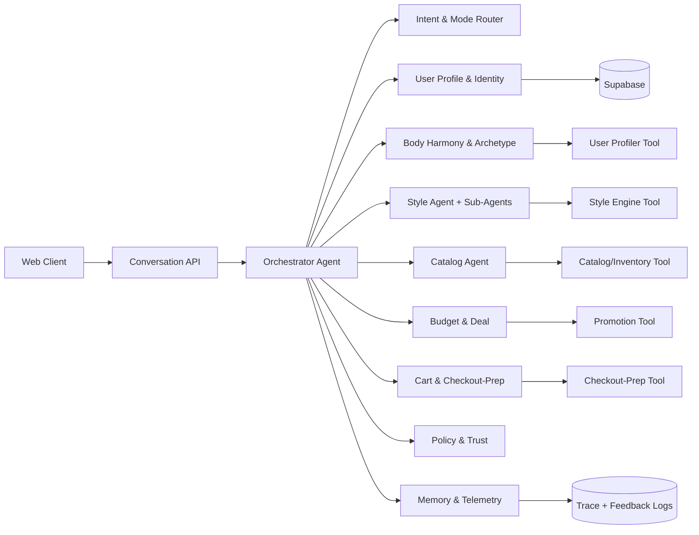
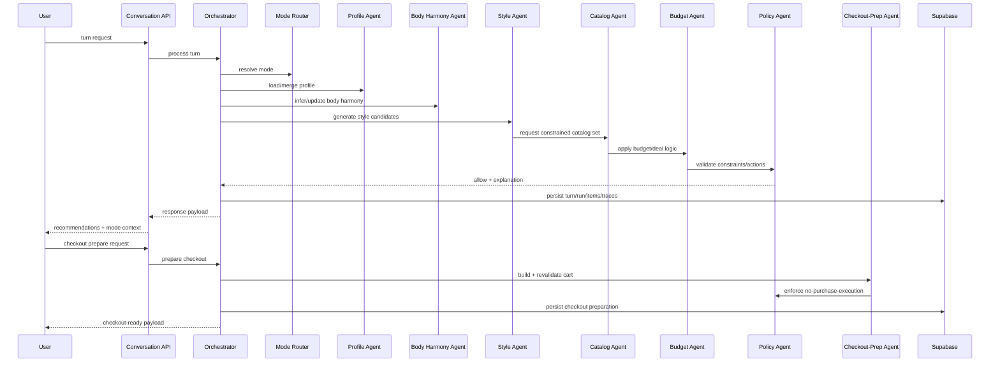

# Conversation Agent Platform

Last updated: February 28, 2026

## Goal
Define the architecture for Agentic Fashion Commerce in the active product scope:
1. Discovery and recommendation.
2. Complete-look composition.
3. Cart build and checkout preparation.

## Scope and Success Criteria
1. In scope: user profile capture, body harmony + archetype inference, mode routing (garment vs outfit), complete-the-look generation, budget optimization, cart assembly, checkout preparation.
2. Out of scope: order placement, payment capture, post-purchase workflows, returns optimization.
3. Success criteria:
   1. User can reach checkout-ready cart in <=3 turns for common intents.
   2. Mode routing accuracy (garment vs outfit) >=95% on eval suite.
   3. Checkout-prep success rate >=98% when stock/price are valid.
   4. No autonomous purchase actions without explicit user approval.

## Agent Map
1. `Orchestrator Agent`
   - Owns turn lifecycle, stage transitions, retries, conflict resolution, and final response build.
   - Priority order: consent/policy -> size constraints -> budget constraints -> style preference.

2. `Intent & Mode Router Agent`
   - Resolves `mode_preference` (`auto|garment|outfit`) into `resolved_mode` (`garment|outfit`).
   - Rule: if user explicitly requests a garment type, resolve to `garment`; else default to `outfit`.
   - Always adds a follow-up `complete_the_look_offer` when mode is `garment`.

3. `User Profile & Identity Agent`
   - Maintains canonical shopper profile: sizes, fit preference, comfort/ease preferences, brand likes/dislikes, budget bands, blocked categories, consent flags.
   - Merges new inputs with existing profile snapshot using last-write-wins for explicit fields.

4. `Body Harmony & Archetype Agent`
   - Owns body harmony inference and archetype context confidence.
   - Publishes hard/soft style constraints consumed by Style Agent and Catalog Agent.

5. `Style Agent`
   - Contains sub-agents:
     - `Style Requirement Interpreter`: parses occasion, vibe, constraints.
     - `Garment Recommender Sub-Agent`: generates best single-item list.
     - `Complete-the-Look Sub-Agent`: generates full looks matching intent and body harmony.
     - `Combo Composer Sub-Agent`: constructs compatible top/bottom/layer/shoes/accessory bundles.
     - `Brand Variance & Comfort Sub-Agent`: applies brand sizing heuristics and ease rules (absorbing fit responsibilities for MVP).

6. `Catalog Agent`
   - Retrieves and filters catalog candidates by style constraints, body constraints, size availability, and inventory/price validity.

7. `Budget & Deal Agent`
   - Enforces budget caps, applies promotions, and substitutes near-equivalent items when constraints fail.

8. `Cart & Checkout-Prep Agent`
   - Builds cart candidates from selected single item or full outfit.
   - Revalidates stock/price at prep time.
   - Returns checkout-ready payload/link/token but does not place order.

9. `Policy & Trust Agent`
   - Enforces action permissions and privacy/consent checks.
   - Blocks unsupported autonomy (e.g., place order).
   - Generates user-facing "why this" and "tradeoff" explanations.

10. `Memory & Telemetry Agent`
    - Persists session memory, run metadata, decisions, and traces for observability and eval.

## System Interaction Diagram

## Turn Lifecycle Diagram

## Tool Architecture

### LLM Tooling
1. Visual inference tool (body harmony extraction).
2. Text intent/archetype inference tool.

### Deterministic Styling Tools
1. Tier-1 hard filters.
2. Tier-2 ranking.
3. Outfit/Combo candidate builder.
4. Intent policy overlay.

### Commerce Tools
1. Catalog retrieval tool (search/filter/rank).
2. Price/inventory validation tool.
3. Promotions/coupon tool.
4. Cart creation/update tool.
5. Checkout preparation tool (token/link generation only).

### Profile Tools
1. Profile store read/write.
2. Size normalization + brand variance lookup.
3. Preference merge tool.

### Control Tools
1. Guardrail/permission checker.
2. Explainability formatter.
3. Telemetry/logging tool.

## Tools-to-Agent Responsibility Matrix

| Agent | Primary Tool(s) | Current Source | Required Additions |
|---|---|---|---|
| Intent & Mode Router | request text parser + mode resolver | `style_engine/outfit_engine.py` | explicit `mode_preference` contract and trace fields |
| User Profile & Identity | profile store + merge logic | `conversation_platform/orchestrator.py`, `conversation_platform/repositories.py` | canonical profile JSON schema (sizes, comfort, brand prefs) |
| Body Harmony & Archetype | visual/text inference | `user_profiler/service.py`, `user_profiler/schemas.py` | confidence tracking per inferred field |
| Style Agent | tier2 ranking + outfit assembly + intent policy | `conversation_platform/agents.py`, `style_engine/intent_policy.py` | formal sub-agent boundaries + complete-the-look contract |
| Catalog Agent | CSV/API retrieval + hard filters | `style_engine/filters.py` | real-time inventory adapter |
| Budget & Deal | reward policy + pricing logic | `reinforcement_framework_v1.json` | promotion/substitution adapter |
| Cart & Checkout-Prep | cart + checkout prep | new | checkout-prep endpoint + persistence |
| Policy & Trust | constraint enforcement | `intent_policy_v1.json` | purchase-block hard gate |
| Memory & Telemetry | traces/logging | `conversation_platform/repositories.py` | per-agent trace schema with scorecards |

## Environment and State Design

### Runtime Services
1. Conversation API service (orchestrator host).
2. User-profiler service.
3. Style-engine service.
4. Supabase (state + telemetry).
5. Commerce adapter service for cart/checkout prep.

### State Layers
1. Session state: intent, resolved mode, pending choices, selected outfit/cart candidate.
2. Persistent user state: profile and preference memory.
3. Run state: recommendation run metadata + candidate lineage.
4. Action state: checkout preparation records and validation results.

### Autonomy Levels
1. `suggest`: recommendations only.
2. `prepare`: cart/checkout preparation only.
3. Disallow `execute_purchase` in MVP.

### Failure Behavior
1. Missing size/profile: clarification request before recommendation.
2. Stock/price invalidation: auto-substitute within budget, otherwise request approval.
3. Mode ambiguity: fallback to outfit mode with explicit switch CTA.

## Adaptability Design (MVP-Compatible)

### Online/Session Adaptation
1. Re-rank within session from explicit events (`like`, `dislike`, `share`, `buy`, `skip`).
2. Boost/deboost categories, silhouettes, colors, and brands immediately.

### Persistent Adaptation
1. Profile updates only from explicit user input or high-confidence repeated behavior.
2. Store confidence per inferred field with timestamp.

### Offline Adaptation
1. Weekly eval run on fixed prompt suite.
2. Update intent keyword maps, combo penalties/bonuses, and budget substitution rules from eval findings.

### Adaptability Boundaries
1. No autonomous mutation of core policy constraints.
2. No inferred size overwrite without explicit confirmation.

## Conflict Resolution Priority
1. Policy and consent constraints.
2. Size/comfort constraints.
3. Budget constraints.
4. Style preference optimization.

## Monitoring and KPI Targets
1. Funnel: recommendation CTR, add-to-cart rate, checkout-prep completion rate.
2. Quality: mode routing accuracy, complete-the-look acceptance rate, substitution acceptance rate.
3. Reliability: p95 turn latency, p95 checkout-prep latency, API error rates.
4. Trust: clarification rate, policy-block count, user override frequency.

## Assumptions and Defaults
1. Deterministic style engine remains ranking source of truth.
2. Dedicated Fit Agent is intentionally excluded in MVP.
3. Post-purchase workflows are intentionally excluded.
4. User-declared size is the primary fit signal.
5. Brand variance and comfort/ease logic live inside Style Agent.
6. Default mode behavior is `auto`; fallback is `outfit`.
7. Default autonomy is `suggest`; checkout prep requires explicit user action.
8. Checkout-prep integrates with commerce APIs but never places orders.

## Non-Goals in This Scope
1. Payment execution.
2. Order placement.
3. Post-order journey automation.
