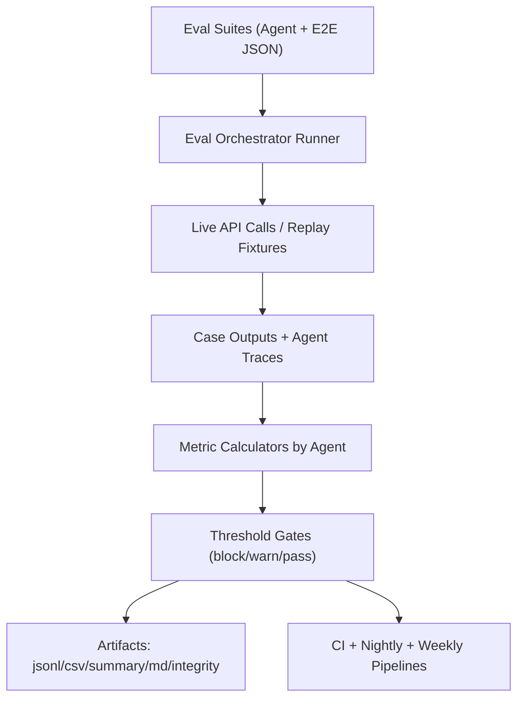

# Eval Implementation Strategy

Last updated: February 28, 2026

## Goal
Define a repeatable evaluation system that measures:
1. Per-agent quality and integrity.
2. End-to-end conversation quality.
3. Regression drift over time.

## Eval Architecture Diagram



## Eval Layers
1. `L0` Static and unit integrity
   - schema, config load, deterministic utility behavior.

2. `L1` Agent contract evals
   - per-agent fixtures with deterministic pass/fail metrics.

3. `L2` Multi-agent integration evals
   - cross-agent flows without full production variability.

4. `L3` End-to-end conversation evals
   - prompt suite scoring against live API responses.

5. `L4` Drift and release monitoring
   - trend analysis, threshold drift alerts, release gating.

## Per-Agent Metric Gates

| Agent | Primary Metrics | Pass Threshold | Warning Threshold | Fail Gate |
|---|---|---:|---:|---|
| Intent & Mode Router | `mode_accuracy`, `garment_precision`, `garment_recall` | 0.95 / 0.97 / 0.90 | 0.92 / 0.94 / 0.85 | Any metric below warning |
| User Profile & Identity | `schema_valid_rate`, `merge_correctness`, `size_completeness` | 1.00 / 0.99 / 0.97 | 0.995 / 0.97 / 0.94 | `schema_valid_rate < 1.00` |
| Body Harmony & Archetype | `enum_valid_rate`, `repeatability`, `confidence_calibration` | 1.00 / 0.90 / ECE<=0.08 | 0.995 / 0.85 / ECE<=0.12 | enum invalid output |
| Style Agent | `constraint_satisfaction`, `look_coherence`, `diversity_ratio` | 0.97 / 0.78 / 0.55 | 0.94 / 0.72 / 0.45 | coherence below warning |
| Catalog Agent | `in_stock_precision`, `requested_type_recall@K`, `duplication_rate` | 0.99 / 0.90 / <=0.05 | 0.97 / 0.85 / <=0.08 | in-stock precision below warning |
| Budget & Deal Agent | `budget_compliance`, `discount_correctness`, `substitution_acceptability` | 0.98 / 0.99 / 0.80 | 0.95 / 0.97 / 0.72 | budget compliance below warning |
| Cart & Checkout-Prep Agent | `prep_success_rate`, `revalidation_accuracy`, `no_purchase_side_effect_rate` | 0.98 / 0.99 / 1.00 | 0.95 / 0.97 / 1.00 | side-effect rate below 1.00 |
| Policy & Trust Agent | `unsafe_block_rate`, `false_block_rate`, `explanation_presence` | 1.00 / <=0.03 / 0.99 | 0.99 / <=0.05 / 0.97 | unsafe block below warning |
| Memory & Telemetry Agent | `trace_completeness`, `id_link_integrity`, `artifact_integrity` | 0.99 / 1.00 / 1.00 | 0.97 / 0.99 / 0.99 | artifact integrity below warning |

## Eval Data and Suite Structure

### Suite Location
1. Per-agent suites: `ops/evals/agents/`
2. E2E suite: `ops/evals/conversation_prompt_suite_diverse_v1.json`

### Suite Format
One suite per agent with `suite_id`, `version`, `cases`.

Case types:
1. Golden deterministic fixtures.
2. Adversarial prompts.
3. Boundary/edge cases.
4. Replay cases from production logs (anonymized).

### Example Agent Suite Schema

```json
{
  "suite_id": "intent_mode_router_v1",
  "version": "1.0.0",
  "cases": [
    {
      "id": "imr_001",
      "input": {"message": "Show me white shirts for office"},
      "expected": {"resolved_mode": "garment", "requested_categories_any": ["top"]},
      "tags": ["garment_mode", "work_mode"]
    }
  ]
}
```

## Artifact Contract
Each eval run must produce:
1. `run_manifest.json`
2. `case_inputs.jsonl`
3. `case_outputs.jsonl`
4. `case_scores.jsonl`
5. `case_scores.csv`
6. `summary.json`
7. `summary.md`
8. `artifact_integrity.json`

## Runner Strategy

### Existing E2E Runner
1. Keep existing end-to-end runner:
   - `ops/scripts/run_conversation_eval.py`

### New Per-Agent Runner
1. Add new runner: `ops/scripts/run_agent_evals.py`

### Evaluator Registry Pattern
Implement per-agent evaluator modules:
1. `intent_mode_router_eval.py`
2. `profile_agent_eval.py`
3. `body_harmony_eval.py`
4. `style_agent_eval.py`
5. `catalog_agent_eval.py`
6. `budget_agent_eval.py`
7. `checkout_prep_eval.py`
8. `policy_agent_eval.py`
9. `telemetry_agent_eval.py`

### Runner Responsibilities
1. Load suite + rubric.
2. Execute cases (live or fixture mode).
3. Score and aggregate metrics.
4. Enforce fail gates.
5. Write artifacts.

## Gate Semantics
1. `pass`: all pass thresholds met.
2. `warning`: no fail conditions but warning thresholds breached.
3. `fail`: any agent fail condition triggered.
4. `fail_integrity`: missing mandatory artifacts or trace links.

## CI Cadence
1. Pull request pipeline:
   - run `L0`, `L1`, and fast `L2` smoke cases.

2. Nightly pipeline:
   - run full `L2` + `L3` suites.

3. Weekly pipeline:
   - run `L4` drift reports and release readiness gate.

## Release Gate Policy
Release candidate is blocked if any of the below occurs:
1. Any integrity gate fails.
2. Any critical-agent fail gate triggers.
3. End-to-end integrity pass rate drops below `0.99`.
4. Mode routing accuracy drops below `0.92`.
5. Checkout-prep no-side-effect rate is below `1.00`.

## Drift Detection
1. Maintain rolling 4-week history for key metrics.
2. Alert when any key metric drops by >=5 percent relative.
3. Mark release as warning/fail based on gate severity.

## Required Trace Fields for Scoring
Each evaluated agent trace should include:
1. `agent_name`
2. `case_id`
3. `input_snapshot`
4. `decision_snapshot`
5. `output_snapshot`
6. `latency_ms`
7. `success`
8. `error_code`
9. `metric_hints` (optional deterministic helpers)

This enables deterministic offline scoring without re-running expensive calls.
